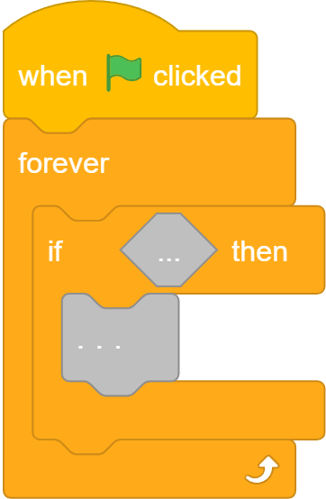
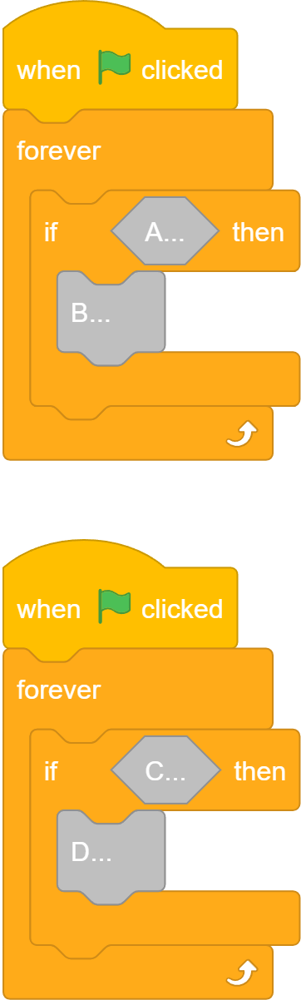
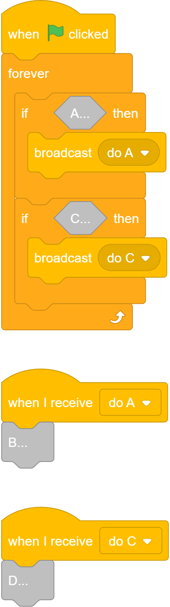

# Analyzing and Editing Projects in `pmp_manip`

## Searching a Project for specific data

### Primitive Attempt
Let us try find e.g. all blocks.
```python
from pmp_manip import get_default_config, init_config, info_api, FRProject

cfg = get_default_config()
init_config(cfg)

# Load or Create a Project
frproject = FRProject.from_file("assets/from_online/my 1st platformer.pmp")
# Convert it into the good format
srproject = frproject.to_second(info_api)

all_blocks = []

# Group Stage and Sprites, as they all have blocks
targets = [srproject.stage] + srproject.sprites
for target in targets:
    # Scan every script in it
    for script in target.scripts:
        # Scan every block in that script
        for block in script.blocks:
            all_blocks.append(block)

            # Oh, but blocks can contain blocks
            for input in block.inputs.values():
                # because SRInputValue itself does not guarantee attribute existance:
                input_block = getattr(input, "block", None)
                input_blocks = getattr(input, "blocks", [])
                if input_block is not None:
                    all_blocks.append(input_block)
                all_blocks.extend(input_blocks)

                # Oh, but these blocks can contain blocks too...
```
It is seemingly harder then we thought. It is technically possible to do this manually, **but `pmp_manip` provides better alternatives.**

### `TreeVisitor`
A `TreeVisitor` object automates the (filtered) iteration of a whole `SRProject` or parts of it.
There are two ways to create a `TreeVisitor` object.

### `TreeVisitor.new_include_all_except(excluded: Iterable[type[SECOND_REPR_T]]) -> TreeVisitor[SECOND_REPR_T]`
`new_include_all_except` creates a `TreeVisitor` which includes all second representation objects except for the specified types.


### `TreeVisitor.new_include_only(included: Iterable[type[INCLUDED_T]]) -> TreeVisitor[INCLUDED_T]`
`new_include_only` creates a `TreeVisitor` which only includes second representation objects of the specified types.

### `TreeVisitor.visit_tree(obj: SECOND_REPR_T) -> dict[AbstractTreePath, INCLUDED_T]`
Run the alredy configured `TreeVisitor` recursively on an Abstract Second Representation Tree.
Returns a map from node path (from tree root to value) to node value.

### Example using `TreeVisitor`
Let us try it:
```python
from pmp_manip import (
    get_default_config, init_config, info_api, FRProject,
    TreeVisitor,
)

cfg = get_default_config()
init_config(cfg)

frproject = FRProject.from_file("assets/from_online/my 1st platformer.pmp")
srproject = frproject.to_second(info_api)

# Create our TreeVisitor with configuration. Let us allow everything for now:
visitor = TreeVisitor.new_include_all_except(excluded=[])

# Run the TreeVisitor
path_to_node_map = visitor.visit_tree(srproject)
# Get only nodes and discard paths (just for this example)
all_nodes = list(path_to_node_map.values())

print(f"Found {len(path_to_node_map)} element(s)")
# Let us see what types of nodes we get
for i, item in enumerate(all_nodes[:10]):
    print(f"Sample node type: {type(item).__name__}")
```
Output:
```
Found 516 element(s)
Sample node type: SRStage
Sample node type: SRScript
Sample node type: SRBlock
Sample node type: SRBlock
Sample node type: SRScriptInputValue
Sample node type: SRBlock
Sample node type: SRBlockAndBoolInputValue
Sample node type: SRScriptInputValue
Sample node type: SRVectorCostume
Sample node type: SRSound
```
We got over 500 nodes of varying types like `SRStage`, `SRBlock` or `SRSound`.
But we are only looking for blocks. For that we need to configure our `TreeVisitor` differently:

```python
from pmp_manip import (
    get_default_config, init_config, info_api, FRProject,
    SRBlock,
    TreeVisitor,
)

cfg = get_default_config()
init_config(cfg)

frproject = FRProject.from_file("assets/from_online/my 1st platformer.pmp")
srproject = frproject.to_second(info_api)

# Let us allow only blocks(SRBlock) this time:
visitor = TreeVisitor.new_include_only(included=[SRBlock])

path_to_node_map = visitor.visit_tree(srproject)
# Get only nodes and discard paths (just for this example)
all_nodes = list(path_to_node_map.values())

print(f"Found {len(path_to_node_map)} element(s)")
for i, item in enumerate(all_nodes[:10]):
    print(f"Sample node type: {type(item).__name__}")
# Print the last one as an example
print("Example Node:")
print(all_nodes[-1])
```
Output:
```
Found 180 element(s)
Sample node type: SRBlock
Sample node type: SRBlock
Sample node type: SRBlock
Sample node type: SRBlock
Sample node type: SRBlock
Sample node type: SRBlock
Sample node type: SRBlock
Sample node type: SRBlock
Sample node type: SRBlock
Sample node type: SRBlock
Example Node:
SRBlock(
    opcode="change [EFFECT] sprite effect by (AMOUNT)",
    inputs={
        "AMOUNT": SRBlockAndTextInputValue(block=None, immediate="25"),
    },
    dropdowns={
        "EFFECT": SRDropdownValue(kind=DropdownValueKind.STANDARD, value="ghost"),
    },
    comment=None,
    mutation=None,
)
```
We reached our goal! You know now how to find all node of a/multiple types in a project.
You can run a `TreeVisitor` on parts of a project too e.g. only the stage, a single script etc.

### Searching for more complex Block and Script Patterns
What if you are not looking for all blocks but only some blocks e.g. with a certain `opcode`?
Or what if you are looking for certain multi-block structures?
`pmp_manip` provides `Pattern` search system for blocks, scripts and related objects.

### Patterns
There is a **corresponding pattern class for every script or block related class.** 
Pattern classes have the **same attributes as their second representation equivalents.**
### `Pattern`
Basis for a Pattern selecting Second Representation Scripts, Blocks etc.
Every subclass corresponds to a specific SR class and matches against its attributes.
#### `Pattern.access_point_id`
* **type**: `str` or `None`
* **description in SR**: An optional identifier for the match location in the Second Representation tree. If provided, the matched object is stored and accessible on success under this access point ID.
* **default value**: `None`
---

### `ScriptPattern`
Pattern for selecting [`SRScript`](second_repr.md#srscript) instances with certain data.
#### `ScriptPattern.position`
* **type**: `ConstOrFunc[tuple[int | float, int | float]]` or `tuple[int | float, int | float]` or `None`
* **description in SR**: Stores the position of the script in the "Code" tab. Unlimited, but usually in the range of hundreds and thousands.
* **default value**: `None`
#### `ScriptPattern.blocks`
* **type**: `ConstOrFunc[list[SRBlock]]` or `list[BlockHandler]`,<br> where `BlockHandler` means `ConstOrFunc[SRBlock]` or `BlockPattern`
* **description in SR**: Stores the script's sequence of blocks from top to bottom.
* **default value**: a function which always succedes.
---

### `BlockPattern`
Pattern for selecting [`SRBlock`](second_repr.md#srblock) instances with certain data.
#### `BlockPattern.opcode`
* **type**: `ConstOrFunc[str]` or `None`
* **description in SR**: The unique identifier for it's kind of block.
* **default value**: `None`
#### `BlockPattern.inputs`
* **type**: `ConstOrFunc[dict[str, SRInputValue]]` or `dict[str, InputHandler]`,<br>where `InputHandler` means `ConstOrFunc[SRInputValue]` or `InputPattern`
* **description in SR**: The arguments fields of the block and their values. Includes text, number fields, round dropdowns one can insert blocks into and all others except for square dropdowns.
* **default value**: `{}`
#### `BlockPattern.dropdowns`
* **type**: `ConstOrFunc[dict[str, SRDropdownValue]]` or `dict[str, DropdownHandler]`,<br>where `DropdownHandler` means `ConstOrFunc[SRDropdownValue]` or `DropdownPattern`
* **description in SR**: The argument fields of the block and their values. Only includes square dropdowns, not round dropdowns one can insert blocks into.
* **default value**: `{}`
#### `BlockPattern.comment`
* **type**: `ConstOrFunc[SRComment | None]` or `None`
* **description in SR**: The optional attached comment of the block.
* **default value**: `None`
#### `BlockPattern.mutation`
* **type**: `ConstOrFunc[SRMutation]` or `CBArgumentMutationPattern` or `CBMutationPattern` or `CBCallMutationPattern` or `None`
* **description in SR**: The optional mutation of the block for some opcodes(kinds of blocks). Most blocks do not need one.
* **default value**: `None`
---

### `InputPattern`
Pattern for selecting [`SRInputValue`](second_repr.md#srinputvalue) instances (or subclasses) with certain data.
#### `InputPattern.blocks`
* **type**: `ConstOrFunc[list[SRBlock]]` or `list[BlockHandler]`,<br> where `BlockHandler` means `ConstOrFunc[SRBlock]` or `BlockPattern`
* **description in SR**: Stores the subscript's sequence of blocks from top to bottom (e.g. the "then" section of the "if" block).
* **default value**: a function which always succedes.
#### `InputPattern.block`
* **type**: `ConstOrFunc[SRBlock | None]` or `BlockPattern` or `None`
* **description in SR**: Stores the optional block inserted into the argument text field, round dropdown menu etc.
* **default value**: `None`
#### `InputPattern.immediate`
* **type**: `ConstOrFunc[str | bool | None]` or `None`
* **description in SR**: the "immediate" value of the input value i.e. if the default value if no block is dragged into the input.
* **default value**: `None`
#### `InputPattern.dropdown`
* **type**: `ConstOrFunc[SRDropdownValue | None]` or `DropdownPattern` or `None`
* **description in SR**: Stores the round dropdown menu of the input value.
* **default value**: `None`
---

### `DropdownPattern`
Pattern for selecting [`SRDropdownValue`](second_repr.md#srdropdownvalue) instances with certain data.
#### `DropdownPattern.kind`
* **type**: `ConstOrFunc[DropdownValueKind]` or `None`
* **description in SR**: Stores the kind of thing the dropdown value refers to (e.g. `VARIABLE`, `SPRITE`, `OBJECT` or `STANDARD`).
* **default value**: `None`
#### `DropdownPattern.value`
* **type**: `ConstOrFunc[str | (int)]` or `None`
* **description in SR**: Stores the actual value of the dropdown value.
* **default value**: `None`
---

### `CBArgumentMutationPattern`
Pattern for selecting [`SRCustomBlockArgumentMutation`](second_repr.md#srcustomblockargumentmutation) instances with certain data.
#### `CBArgumentMutationPattern.argument_name`
* **type**: `ConstOrFunc[str]` or `None`
* **description in SR**: the name of the custom block argument which the argument reporter block is for.
* **default value**: `None`
#### `CBArgumentMutationPattern.main_color`
* **type**: `ConstOrFunc[str]` or `None`
* **description in SR**: the main color of the "define" block the argument reporter block is for.
* **default value**: `None`
#### `CBArgumentMutationPattern.prototype_color`
* **type**: `ConstOrFunc[str]` or `None`
* **description in SR**: the main color of the inner block of the "define" block the argument reporter block is for.
* **default value**: `None`
#### `CBArgumentMutationPattern.outline_color`
* **type**: `ConstOrFunc[str]` or `None`
* **description in SR**: the outline color of the inner block of the "define" block the argument reporter block is for.
* **default value**: `None`
---

### `CBMutationPattern`
Pattern for selecting [`SRCustomBlockMutation`](second_repr.md#srcustomblockmutation) instances with certain data.
#### `CBMutationPattern.custom_opcode`
* **type**: `ConstOrFunc[SRCustomBlockOpcode]` or `CBOpcodePattern` or `None`
* **description in SR**: Stores the name and argument field names and kinds of the custom block.
* **default value**: `None`
#### `CBMutationPattern.no_screen_refresh`
* **type**: `ConstOrFunc[bool]` or `None`
* **description in SR**: Wether the "Run without screen refresh" box was ticked when creating the custom block.
* **default value**: `None`
#### `CBMutationPattern.optype`
* **type**: `ConstOrFunc[SRCustomBlockOptype]` or `None`
* **description in SR**: What shape of block the custom block is (e.g. square statement, boolean, reporter).
* **default value**: `None`
#### `CBMutationPattern.main_color`
* **type**: `ConstOrFunc[str]` or `None`
* **description in SR**: the main color of the "define" block.
* **default value**: `None`
#### `CBMutationPattern.prototype_color`
* **type**: `ConstOrFunc[str]` or `None`
* **description in SR**: the main color of the inner block of the "define" block.
* **default value**: `None`
#### `CBMutationPattern.outline_color`
* **type**: `ConstOrFunc[str]` or `None`
* **description in SR**: the outline color of the inner block of the "define" block the argument reporter block is for.
* **default value**: `None`
---

### `CBCallMutationPattern`
Pattern for selecting [`SRCustomBlockCallMutation`](second_repr.md#srcustomblockcallmutation) instances with certain data.
#### `CBCallMutationPattern.custom_opcode`
* **type**: `ConstOrFunc[SRCustomBlockOpcode]` or `CBOpcodePattern` or `None`
* **description in SR**: Stores the labels and argument field names and kinds of the custom block, this block will call, to reference it.
* **default value**: `None`
---

### `CBOpcodePattern`
Pattern for selecting [`SRCustomBlockOpcode`](second_repr.md#srcustomblockopcode) instances with certain data.
#### `CBOpcodePattern.segments`
* **type**: `ConstOrFunc[tuple[str | SRCustomBlockArgument]]` or `tuple[CBArgumentHandler]` or `None`<br> where `CBArgumentHandler` means `ConstOrFunc[str | SRCustomBlockArgument]` or `CBArgumentPattern`
* **description in SR**: Stores the labels and argument field names and kinds of the custom block. A `str` item represents a label, a `SRCustomBlockArgument` represents an argument of the custom block.
* **default value**: `None`
---

### `CBArgumentPattern`
Pattern for selecting [`SRCustomBlockArgument`](second_repr.md#srcustomblockargument) instances with certain data.
#### `CBArgumentPattern.name`
* **type**: `ConstOrFunc[str]` or `None`
* **description in SR**: the name of the argument.
* **default value**: `None`
#### `CBArgumentPattern.type`
* **type**: `ConstOrFunc[SRCustomBlockArgumentType]` or `None`
* **description in SR**: the kind of the argument (string or number vs. boolean).
* **default value**: `None`

Notes:
* see SR Class link for details on attributes etc.
---

### `PatternConst`
Requires an exact constant value at it's location in a pattern or similar. 
#### `PatternConst.value`
* **type**: `Any`
* **description**: the exact constant value required for a successful match.

### `match_handler`
Checks if a [`Constant`](#PatternConst), [`Pattern`](#pattern) or [`Callable`](#custom-functionlike-handler) matches with a Second Representation Tree.
On Success a [`SuccessfulMatchResult`](#SuccessfulMatchResult) is returned. On Fail `None` is returned.

### Terminology and Matching Notes
* `ConstOrFunc[X]` means either [`PatternConst`](#patternconst) or `Callable[[X], SuccessfulMatchResult|None]`
* "**Handler**" means either a subclass of [`Pattern`](#pattern), a [custom function](#custom-functionlike-handler).
* When a `list` or `tuple` value is match checked, it needs to has the exact same length as the handler for a success. All items must match the handler items. For more control use a [custom handler](#custom-functionlike-handler).
* When a `dict` is match checked, all keys of the handler must be included in the value. Additional keys are ignored. The values of the required keys must also match with the handler values. For more control use a [custom handler](#custom-functionlike-handler).

### `SuccessfulMatchResult`
Represents the result of a sucessful match usuallly from a Pattern with a Second Representation Tree.
Allows the access of auto-filled access points by their id.

### Custom Functionlike Handler
* A custom callable (e.g. `def` or `lambda` function).
* Takes one argument of the specified type.
* Should return a [`SuccessfulMatchResult`](#SuccessfulMatchResult) if it consideres with the given value a match otherwise `None`.
* For an example, see [Example: Using Custom Handlers](#example-using-custom-handlers)

### Example: Creating A Pattern
In this example, we are looking for this kind of block/script:<br>

Since we are looking for a whole script we should create a [`ScriptPattern`](#scriptpattern) at the root. The first block must be a "when green flag clicked" block.
```python
from pmp_manip import (
    get_default_config, init_config,
    ScriptPattern, BlockPattern, PatternConst,
)

cfg = get_default_config()
init_config(cfg)

# Lets create the pattern we are looking for 
pattern = ScriptPattern(
    blocks=[
        BlockPattern(
            # A constant, because we only want to allow this one specific value.
            opcode=PatternConst(value="when green flag clicked"),
            # ... Has more properties which can be filtered. See Note 1
        )
    ],
    # Optional, See Note 1:
    # position=None,
)
print("Our pattern is:")
print(pattern)
```
Output:
```python
Our pattern is:
ScriptPattern(
    position=None,
    blocks=[
        BlockPattern(
            opcode=PatternConst(value="when green flag clicked"),
            inputs={},
            dropdowns={},
            comment=None,
            mutation=None,
            access_point_id=None,
        ),
    ],
    access_point_id=None,
)
```
Notes:
* All attributes are **optional**. Not setting an argument in initialization will lead to it being **ignored and always succeed** in `match_handler`.
* `access_point_id` is used later, you can ignore it for now.

But we are not done with our pattern, it is still missing the requirement for the "forever" block, which contains a "if" block:
```python
from pmp_manip import (
    get_default_config, init_config,
    ScriptPattern, BlockPattern, InputPattern, PatternConst,
)

cfg = get_default_config()
init_config(cfg)

pattern = ScriptPattern(
    blocks=[
        BlockPattern(opcode=PatternConst(value="when green flag clicked")),
        BlockPattern(
            opcode=PatternConst(value="forever {BODY}"),
            inputs={
                # We expect a substack containing a block
                "BODY": InputPattern(
                    blocks=[
                        BlockPattern(
                            # That block must be an "if" block.
                            opcode=PatternConst(value="if <CONDITION> then {THEN}"),
                        ),
                    ],
                ),
            },
        ),
    ],
)
print("Our pattern is:")
print(pattern)
```
Output:
```python
Our pattern is:
ScriptPattern(
    position=None,
    blocks=[
        BlockPattern(
            opcode=PatternConst(value="when green flag clicked"),
            inputs={},
            dropdowns={},
            comment=None,
            mutation=None,
            access_point_id=None,
        ),
        BlockPattern(
            opcode=PatternConst(value="forever {BODY}"),
            inputs={
                "BODY": InputPattern(
                    blocks=[
                        BlockPattern(
                            opcode=PatternConst(value="if <CONDITION> then {THEN}"),
                            inputs={},
                            dropdowns={},
                            comment=None,
                            mutation=None,
                            access_point_id=None,
                        ),
                    ],
                    block=None,
                    immediate=None,
                    dropdown=None,
                    access_point_id=None,
                ),
            },
            dropdowns={},
            comment=None,
            mutation=None,
            access_point_id=None,
        ),
    ],
    access_point_id=None,
)
```
### Example: Searching with a Pattern
Let us now use the above pattern:
```python
from pmp_manip import (
    get_default_config, init_config, info_api, FRProject, SRScript,
    ScriptPattern, BlockPattern, InputPattern, PatternConst,
    TreeVisitor, AbstractTreePath, match_handler,
)

cfg = get_default_config()
init_config(cfg)

frproject = FRProject.from_file("assets/from_online/my 1st platformer.pmp")
srproject = frproject.to_second(info_api)

# Use our pattern from above
pattern = ScriptPattern(
    blocks=[
        BlockPattern(opcode=PatternConst(value="when green flag clicked")),
        BlockPattern(
            opcode=PatternConst(value="forever {BODY}"),
            inputs={
                "BODY": InputPattern(
                    blocks=[
                        BlockPattern(
                            opcode=PatternConst(value="if <CONDITION> then {THEN}"),
                        ),
                    ],
                ),
            },
        ),
    ],
)

visitor = TreeVisitor.new_include_only(included=[SRScript])
# Run the TreeVisitor only on the first sprite(=> no scripts from stage or other sprite will even be considered)
player_sprite = srproject.sprites[0]
path_to_node_map = visitor.visit_tree(player_sprite)
# Find all matches
matches: list[tuple[AbstractTreePath, SRScript]] = []
for path, node in path_to_node_map.items():
    match_result = match_handler(handler=pattern, value=node)
    if match_result is not None:
        matches.append((path, node))

# Print first match fully
first_match_path, first_match_node = matches[0]
print("A match found at", first_match_path)
print("Matching Script:")
print(first_match_node)

# Only print block inside "CONDITION" input of other matches for brevity
for match_path, match_node in matches[1:]:
    forever_block = match_node.blocks[1]
    # "BODY" must be a SRScriptInputValue => must have .blocks
    if_block = forever_block.inputs["BODY"].blocks[0]
    # "CONDITION" must be SRBlockAndBoolInputValue => must have .block, but could be none since not checked by pattern
    condition_block = if_block.inputs["CONDITION"].block

    print() # Seperator
    print("A match found at", match_path)
    print("Condition block:")
    print(condition_block)
```
Output:
```python
A match found at AbstractTreePath(.scripts[1])
Matching Script:
SRScript(
    position=(410, 63),
    blocks=[
        SRBlock(
            opcode="when green flag clicked",
            inputs={},
            dropdowns={},
            comment=None,
            mutation=None,
        ),
        SRBlock(
            opcode="forever {BODY}",
            inputs={
                "BODY": SRScriptInputValue(
                    blocks=[
                        SRBlock(
                            opcode="if <CONDITION> then {THEN}",
                            inputs={
                                "CONDITION": SRBlockAndBoolInputValue(
                                    block=SRBlock(
                                        opcode="key ([KEY]) pressed?",
                                        inputs={
                                            "KEY": SRBlockAndDropdownInputValue(
                                                block=None,
                                                dropdown=SRDropdownValue(kind=DropdownValueKind.STANDARD, value="m"),
                                            ),
                                        },
                                        dropdowns={},
                                        comment=None,
                                        mutation=None,
                                    ),
                                    immediate=False,
                                ),
                                "THEN": SRScriptInputValue(
                                    blocks=[
                                        SRBlock(
                                            opcode="switch costume to ([COSTUME])",
                                            inputs={
                                                "COSTUME": SRBlockAndDropdownInputValue(
                                                    block=None,
                                                    dropdown=SRDropdownValue(kind=DropdownValueKind.COSTUME, value="costume2"),
                                                ),
                                            },
                                            dropdowns={},
                                            comment=None,
                                            mutation=None,
                                        ),
                                        SRBlock(
                                            opcode="wait (SECONDS) seconds",
                                            inputs={
                                                "SECONDS": SRBlockAndTextInputValue(block=None, immediate="0.4"),
                                            },
                                            dropdowns={},
                                            comment=None,
                                            mutation=None,
                                        ),
                                        SRBlock(
                                            opcode="switch costume to ([COSTUME])",
                                            inputs={
                                                "COSTUME": SRBlockAndDropdownInputValue(
                                                    block=None,
                                                    dropdown=SRDropdownValue(kind=DropdownValueKind.COSTUME, value="costume1"),
                                                ),
                                            },
                                            dropdowns={},
                                            comment=None,
                                            mutation=None,
                                        ),
                                    ],
                                ),
                            },
                            dropdowns={},
                            comment=None,
                            mutation=None,
                        ),
                    ],
                ),
            },
            dropdowns={},
            comment=None,
            mutation=None,
        ),
    ],
)

A match found at AbstractTreePath(.scripts[4])
Condition block:
SRBlock(
    opcode="key ([KEY]) pressed?",
    inputs={
        "KEY": SRBlockAndDropdownInputValue(
            block=None,
            dropdown=SRDropdownValue(kind=DropdownValueKind.STANDARD, value="right arrow"),
        ),
    },
    dropdowns={},
    comment=None,
    mutation=None,
)

A match found at AbstractTreePath(.scripts[5])
Condition block:
SRBlock(
    opcode="key ([KEY]) pressed?",
    inputs={
        "KEY": SRBlockAndDropdownInputValue(
            block=None,
            dropdown=SRDropdownValue(kind=DropdownValueKind.STANDARD, value="left arrow"),
        ),
    },
    dropdowns={},
    comment=None,
    mutation=None,
)

A match found at AbstractTreePath(.scripts[7])
Condition block:
SRBlock(
    opcode="key ([KEY]) pressed?",
    inputs={
        "KEY": SRBlockAndDropdownInputValue(
            block=None,
            dropdown=SRDropdownValue(kind=DropdownValueKind.STANDARD, value="up arrow"),
        ),
    },
    dropdowns={},
    comment=None,
    mutation=None,
)

A match found at AbstractTreePath(.scripts[8])
Condition block:
SRBlock(
    opcode="not <OPERAND>",
    inputs={
        "OPERAND": SRBlockAndBoolInputValue(
            block=SRBlock(
                opcode="touching color (COLOR) ?",
                inputs={
                    "COLOR": SRBlockAndTextInputValue(block=None, immediate="#000000"),
                },
                dropdowns={},
                comment=None,
                mutation=None,
            ),
            immediate=False,
        ),
    },
    dropdowns={},
    comment=None,
    mutation=None,
)

A match found at AbstractTreePath(.scripts[9])
Condition block:
SRBlock(
    opcode="touching color (COLOR) ?",
    inputs={
        "COLOR": SRBlockAndTextInputValue(block=None, immediate="#d8d8d8"),
    },
    dropdowns={},
    comment=None,
    mutation=None,
)

A match found at AbstractTreePath(.scripts[11])
Condition block:
SRBlock(
    opcode="touching ([OBJECT]) ?",
    inputs={
        "OBJECT": SRBlockAndDropdownInputValue(
            block=None,
            dropdown=SRDropdownValue(kind=DropdownValueKind.SPRITE, value="    "),
        ),
    },
    dropdowns={},
    comment=None,
    mutation=None,
)

A match found at AbstractTreePath(.scripts[14])
Condition block:
SRBlock(
    opcode="touching color (COLOR) ?",
    inputs={
        "COLOR": SRBlockAndTextInputValue(block=None, immediate="#84542f"),
    },
    dropdowns={},
    comment=None,
    mutation=None,
)

A match found at AbstractTreePath(.scripts[15])
Condition block:
SRBlock(
    opcode="touching color (COLOR) ?",
    inputs={
        "COLOR": SRBlockAndTextInputValue(block=None, immediate="#c07b46"),
    },
    dropdowns={},
    comment=None,
    mutation=None,
)

A match found at AbstractTreePath(.scripts[16])
Condition block:
SRBlock(
    opcode="touching ([OBJECT]) ?",
    inputs={
        "OBJECT": SRBlockAndDropdownInputValue(
            block=None,
            dropdown=SRDropdownValue(kind=DropdownValueKind.SPRITE, value="Sprite1"),
        ),
    },
    dropdowns={},
    comment=None,
    mutation=None,
)

A match found at AbstractTreePath(.scripts[17])
Condition block:
SRBlock(
    opcode="touching color (COLOR) ?",
    inputs={
        "COLOR": SRBlockAndTextInputValue(block=None, immediate="#1465ee"),
    },
    dropdowns={},
    comment=None,
    mutation=None,
)
```
It worked.

### Example: Using Custom Handlers
What if you want more control during the match process?
For more structural information, see [Custom Functionlike Handler](#custom-functionlike-handler)
For example, what if you want a dynamic opcode check?
```python
from pmp_manip import (
    get_default_config, init_config, info_api, FRProject, SRScript,
    ScriptPattern, BlockPattern, InputPattern, PatternConst,
    TreeVisitor, AbstractTreePath, SuccessfulMatchResult, match_handler,
)

cfg = get_default_config()
init_config(cfg)

frproject = FRProject.from_file("assets/from_online/my 1st platformer.pmp")
srproject = frproject.to_second(info_api)

def allow_opcode(opcode: str) -> SuccessfulMatchResult | None:
    # Do whatever you want...
    # Here I am using the custom handler to allow multiple values at a certain location
    allowed = opcode in [
        "if <CONDITION> then {THEN}",
        "if <CONDITION> then {THEN} else {ELSE}",
        "switch (CONDITION) {CASES}",
        "switch (CONDITION) {CASES} default {DEFAULT}",
    ]
    # We can return an empty result, as we do not care about access points (discussed later)
    return SuccessfulMatchResult() if allowed else None

# Use our pattern from above
pattern = ScriptPattern(
    blocks=[
        BlockPattern(opcode=PatternConst(value="when green flag clicked")),
        BlockPattern(
            opcode=PatternConst(value="forever {BODY}"),
            inputs={
                "BODY": InputPattern(
                    blocks=[
                        BlockPattern(
                            # Provide the function instead of a Const
                            opcode=allow_opcode,
                        ),
                    ],
                ),
            },
        ),
    ],
)

visitor = TreeVisitor.new_include_only(included=[SRScript])
# Run the TreeVisitor on the whole project
path_to_node_map = visitor.visit_tree(srproject)
# Find all matches
matches: list[tuple[AbstractTreePath, SRScript]] = []
for path, node in path_to_node_map.items():
    match_result = match_handler(handler=pattern, value=node)
    if match_result is not None:
        matches.append((path, node))

# Print some matches for brevity
for index, path_and_node in enumerate(matches):
    match_path, match_node = path_and_node
    forever_block = match_node.blocks[1]
    # "BODY" must be a SRScriptInputValue => must have .blocks
    if_block_or_similar = forever_block.inputs["BODY"].blocks[0]
    # Print the first and different ones:
    if (index == 0) or (if_block_or_similar.opcode != "if <CONDITION> then {THEN}"):
        print("An interesting match found at", match_path)
        print("Matching Script:")
        print(match_node)
```
Output:
```python
An interesting match found at AbstractTreePath(.stage.scripts[0])
Matching Script:
SRScript(
    position=(-616, -568),
    blocks=[
        SRBlock(
            opcode="when green flag clicked",
            inputs={},
            dropdowns={},
            comment=None,
            mutation=None,
        ),
        SRBlock(
            opcode="forever {BODY}",
            inputs={
                "BODY": SRScriptInputValue(
                    blocks=[
                        SRBlock(
                            opcode="if <CONDITION> then {THEN}",
                            inputs={
                                "CONDITION": SRBlockAndBoolInputValue(block=None, immediate=False),
                                "THEN": SRScriptInputValue(blocks=[]),
                            },
                            dropdowns={},
                            comment=None,
                            mutation=None,
                        ),
                    ],
                ),
            },
            dropdowns={},
            comment=None,
            mutation=None,
        ),
    ],
)
An interesting match found at AbstractTreePath(.sprites[0].scripts[20])
Matching Script:
SRScript(
    position=(823, 492),
    blocks=[
        SRBlock(
            opcode="when green flag clicked",
            inputs={},
            dropdowns={},
            comment=SRComment(
                position=(1190.1650663579926, 499.70370370370347),
                size=(200, 200),
                is_minimized=False,
                text="this script was added by the documentator for illustration purposes",
            ),
            mutation=None,
        ),
        SRBlock(
            opcode="forever {BODY}",
            inputs={
                "BODY": SRScriptInputValue(
                    blocks=[
                        SRBlock(
                            opcode="switch (CONDITION) {CASES}",
                            inputs={
                                "CONDITION": SRBlockOnlyInputValue(
                                    block=SRBlock(
                                        opcode="value of [VARIABLE]",
                                        inputs={},
                                        dropdowns={
                                            "VARIABLE": SRDropdownValue(kind=DropdownValueKind.VARIABLE, value="my variable"),
                                        },
                                        comment=None,
                                        mutation=None,
                                    ),
                                ),
                                "CASES": SRScriptInputValue(
                                    blocks=[
                                        # Abbreviated here
                                    ],
                                ),
                            },
                            dropdowns={},
                            comment=None,
                            mutation=None,
                        ),
                    ],
                ),
            },
            dropdowns={},
            comment=None,
            mutation=None,
        ),
    ],
)
An interesting match found at AbstractTreePath(.sprites[6].scripts[5])
Matching Script:
SRScript(
    position=(-192, -85),
    blocks=[
        SRBlock(
            opcode="when green flag clicked",
            inputs={},
            dropdowns={},
            comment=None,
            mutation=None,
        ),
        SRBlock(
            opcode="forever {BODY}",
            inputs={
                "BODY": SRScriptInputValue(
                    blocks=[
                        SRBlock(
                            opcode="if <CONDITION> then {THEN} else {ELSE}",
                            # Abbreviated here
                        ),
                    ],
                ),
            },
            dropdowns={},
            comment=None,
            mutation=None,
        ),
    ],
)
```
Or what if you want to allow a `list` of any size and just check e.g. a specific item?
Let us first create the pattern:
```python
pattern = ScriptPattern(
    blocks=[
        BlockPattern(
            opcode=PatternConst(value="when I receive [MESSAGE]"),
            dropdowns={
                "MESSAGE": DropdownPattern(
                    # kind is always the same, we do not care
                    # Only allow lower case messages:
                    value=lambda v: str.islower(v)
                )
            },
        ),
        # ...
    ],
)
```
At `...` we want to allow anything and any count of blocks, but that is not possible with the current system.
So we need to use a custom handler:
```python
from pmp_manip import (
    get_default_config, init_config, info_api, FRProject, SRScript, SRBlock,
    ScriptPattern, BlockPattern, DropdownPattern, PatternConst,
    TreeVisitor, AbstractTreePath, SuccessfulMatchResult, match_handler,
)

cfg = get_default_config()
init_config(cfg)

frproject = FRProject.from_file("assets/from_online/my 1st platformer.pmp")
srproject = frproject.to_second(info_api)

def allow_broadcast_message(msg: str) -> SuccessfulMatchResult | None:
    # Only allow lower case messages:
    if msg.islower():
        return SuccessfulMatchResult()
    else:
        return None

def are_blocks_acceptible(blocks: list[SRBlock]) -> SuccessfulMatchResult | None:
    # We are expecting at least one block:
    if len(blocks) <= 1:
        return None
    # Create the pattern we only want to apply to the first block:
    first_block_pattern = BlockPattern(
        opcode=PatternConst(value="when I receive [MESSAGE]"),
        dropdowns={
            "MESSAGE": DropdownPattern(
                # kind is always the same, we do not care
                value=allow_broadcast_message,
            )
        },
    )
    # Use the match system, just not for the whole blocks list, but only for the first block:
    first_block = blocks[0]
    match_result = match_handler(
        handler=first_block_pattern,
        value=first_block,
    )
    # Just add some arbitrary condition for a better example:
    if (match_result is not None) and True:
        return match_result
        # OR for an empty feedback:
        # return SuccessfulMatchResult()
    else:
        return None

# Use our pattern from above
pattern = ScriptPattern(
    blocks=are_blocks_acceptible
)

visitor = TreeVisitor.new_include_only(included=[SRScript])
# Run the TreeVisitor on the whole project
path_to_node_map = visitor.visit_tree(srproject)
# Find all matches
matches: list[tuple[AbstractTreePath, SRScript]] = []
for path, node in path_to_node_map.items():
    match_result = match_handler(handler=pattern, value=node)
    if match_result is not None:
        matches.append((path, node))

for index, path_and_node in enumerate(matches):
    match_path, match_node = path_and_node
    print("An interesting match found at", match_path)
    print("Matching Script:")
    print(match_node)
```
Output:
```python
An interesting match found at AbstractTreePath(.sprites[0].scripts[10])
Matching Script:
SRScript(
    position=(-976, -1638),
    blocks=[
        SRBlock(
            opcode="when I receive [MESSAGE]",
            inputs={},
            dropdowns={
                "MESSAGE": SRDropdownValue(kind=DropdownValueKind.BROADCAST_MSG, value="reset"),
            },
            comment=None,
            mutation=None,
        ),
        SRBlock(
            opcode="set [EFFECT] sprite effect to (VALUE)",
            inputs={
                "VALUE": SRBlockAndTextInputValue(block=None, immediate="0"),
            },
            dropdowns={
                "EFFECT": SRDropdownValue(kind=DropdownValueKind.STANDARD, value="ghost"),
            },
            comment=None,
            mutation=None,
        ),
        SRBlock(
            opcode="point in direction (DIRECTION)",
            # Abbreviated here
        ),
        SRBlock(
            opcode="switch costume to ([COSTUME])",
            # Abbreviated here
        ),
        SRBlock(
            opcode="set [VARIABLE] to (VALUE)",
            # Abbreviated here
        ),
        SRBlock(
            opcode="set [VARIABLE] to (VALUE)",
            # Abbreviated here
        ),
    ],
)
An interesting match found at AbstractTreePath(.sprites[0].scripts[12])
Matching Script:
SRScript(
    position=(-1398, -1857),
    blocks=[
        SRBlock(
            opcode="when I receive [MESSAGE]",
            inputs={},
            dropdowns={
                "MESSAGE": SRDropdownValue(kind=DropdownValueKind.BROADCAST_MSG, value="oq"),
            },
            comment=None,
            mutation=None,
        ),
        SRBlock(
            opcode="set [EFFECT] sprite effect to (VALUE)",
            inputs={
                "VALUE": SRBlockAndTextInputValue(block=None, immediate="0"),
            },
            dropdowns={
                "EFFECT": SRDropdownValue(kind=DropdownValueKind.STANDARD, value="ghost"),
            },
            comment=None,
            mutation=None,
        ),
        SRBlock(
            opcode="point in direction (DIRECTION)",
            # Abbreviated here
        ),
        SRBlock(
            opcode="switch costume to ([COSTUME])",
            # Abbreviated here
        ),
        SRBlock(
            opcode="set [VARIABLE] to (VALUE)",
            # Abbreviated here
        ),
        SRBlock(
            opcode="set [VARIABLE] to (VALUE)",
            # Abbreviated here
        ),
    ],
)
An interesting match found at AbstractTreePath(.sprites[0].scripts[13])
Matching Script:
SRScript(
    position=(-1029, -1792),
    blocks=[
        SRBlock(
            opcode="when I receive [MESSAGE]",
            inputs={},
            dropdowns={
                "MESSAGE": SRDropdownValue(kind=DropdownValueKind.BROADCAST_MSG, value="reset"),
            },
            comment=None,
            mutation=None,
        ),
        SRBlock(
            opcode="play sound ([SOUND]) until done",
            inputs={
                "SOUND": SRBlockAndDropdownInputValue(
                    block=None,
                    dropdown=SRDropdownValue(kind=DropdownValueKind.SOUND, value="male-death-sound-128357"),
                ),
            },
            dropdowns={},
            comment=None,
            mutation=None,
        ),
    ],
)
An interesting match found at AbstractTreePath(.sprites[4].scripts[0])
Matching Script:
SRScript(
    position=(-670, -650),
    blocks=[
        SRBlock(
            opcode="when I receive [MESSAGE]",
            inputs={},
            dropdowns={
                "MESSAGE": SRDropdownValue(kind=DropdownValueKind.BROADCAST_MSG, value="oq"),
            },
            comment=None,
            mutation=None,
        ),
        SRBlock(
            opcode="change [VARIABLE] by (VALUE)",
            inputs={
                "VALUE": SRBlockAndTextInputValue(block=None, immediate="1"),
            },
            dropdowns={
                "VARIABLE": SRDropdownValue(kind=DropdownValueKind.VARIABLE, value="level"),
            },
            comment=None,
            mutation=None,
        ),
    ],
)
An interesting match found at AbstractTreePath(.sprites[6].scripts[1])
Matching Script:
SRScript(
    position=(525, -64),
    blocks=[
        SRBlock(
            opcode="when I receive [MESSAGE]",
            inputs={},
            dropdowns={
                "MESSAGE": SRDropdownValue(kind=DropdownValueKind.BROADCAST_MSG, value="wae"),
            },
            comment=None,
            mutation=None,
        ),
        SRBlock(
            opcode="show",
            inputs={},
            dropdowns={},
            comment=None,
            mutation=None,
        ),
        SRBlock(
            opcode="if <CONDITION> then {THEN}",
            # Abbreviated here
        ),
    ],
)
```
Note: If you have multiple sub-results, you can use `SuccessfulMatchResult.merge_from`:
```python
def my_hander(some_arg) -> SuccessfulMatchResult | None:
    ...
    result_a = match_handler(..., ...)
    result_b = match_handler(..., ...)
    result_c = match_handler(..., ...)
    if (result_a is not None) and (result_b is not None) and (result_c is not None):
        result = SuccessfulMatchResult()
        result.merge_from(result_a)
        result.merge_from(result_b)
        result.merge_from(result_c)
        return result
    else:
        return None
```

## Editing a Project

### Example: Editing a Project
Let us continue the above example. We want to convert these scripts<br><br><br>
<br><br><br>
**into**<br><br><br>
<br><br><br>
```python
from pmp_manip import (
    get_default_config, init_config, info_api,
    FRProject, SRScript, SRBlock, 
    SRScriptInputValue, SRBlockAndBoolInputValue, SRBlockAndDropdownInputValue, SRDropdownValue, DropdownValueKind,
    ScriptPattern, BlockPattern, InputPattern, PatternConst,
    TreeVisitor, AbstractTreePath, set_path_in_tree, match_handler,
)

cfg = get_default_config()
init_config(cfg)

frproject = FRProject.from_file("assets/from_online/my 1st platformer.pmp")
srproject = frproject.to_second(info_api)

# Use our pattern from above
pattern = ScriptPattern(
    blocks=[
        BlockPattern(opcode=PatternConst(value="when green flag clicked")),
        BlockPattern(
            opcode=PatternConst(value="forever {BODY}"),
            inputs={
                "BODY": InputPattern(
                    blocks=[
                        BlockPattern(
                            opcode=PatternConst(value="if <CONDITION> then {THEN}"),
                        ),
                    ],
                ),
            },
        ),
    ],
)

visitor = TreeVisitor.new_include_only(included=[SRScript])
path_to_node_map = visitor.visit_tree(srproject)

messages_and_conditions: list[tuple[SRDropdownValue, SRBlock]] = []
for path, node in path_to_node_map.items():
    match_result = match_handler(handler=pattern, value=node)
    if match_result is None:
        continue

    script: SRScript = node
    forever_block = script.blocks[1]
    # "BODY" must be a SRScriptInputValue => must have .blocks
    if_block = forever_block.inputs["BODY"].blocks[0]
    # "CONDITION" must be SRBlockAndBoolInputValue => must have .block, but could be none since not checked by pattern
    condition_block = if_block.inputs["CONDITION"].block
    # "THEN" must be a SRScriptInputValue => must have .blocks
    then_blocks = if_block.inputs["THEN"].blocks
    
    # Create and print the new "when I receive" script
    script_index = path[-1].value # e.g. AbstractTreePath(.sprites[0].scripts[5]) => 5 
    message = SRDropdownValue(
        kind=DropdownValueKind.STANDARD, # as broadcasts do not reference a sprite, variable etc.
        value=f"loop event {script_index}"
    )
    new_script = SRScript(
        position=script.position,
        blocks=[
            SRBlock(
                opcode="when I receive [MESSAGE]",
                dropdowns={
                    "MESSAGE": message,
                },
            ),
            # When the message is received, blocks in "THEN" should run:
            *then_blocks
        ],
    )
    print("New script to replace old one:")
    print(new_script)
    
    # Replace the old with the new script in the same location
    set_path_in_tree(
        tree=srproject,
        path=path,
        value=new_script,
    )
    
    # Store block in "CONDITION" and broadcast message for later
    messages_and_conditions.append((message, condition_block))

# Create the "main loop" script, which checks all conditions, and sends broadcasts
# First create all the seperate "if" checks:
event_check_blocks = []
for message, condition_block in messages_and_conditions:
    event_check_block = SRBlock(
        opcode="if <CONDITION> then {THEN}",
        inputs={
            # Check if "CONDITION" fulfilled
            "CONDITION": SRBlockAndBoolInputValue(
                block=condition_block,
                immediate=False,
            ),
            "THEN": SRScriptInputValue(
                blocks=[
                    # If yes broadcast the message which wil be received by another script, which actually does the things
                    SRBlock(
                        opcode="broadcast ([MESSAGE])",
                        inputs={
                            "MESSAGE": SRBlockAndDropdownInputValue(
                                block=None,
                                dropdown=message,
                            ),
                        },
                    )
                ],
            ),
        },
    )
    event_check_blocks.append(event_check_block)

# Then put them into a forever loop
main_loop_script = SRScript(
    position=(0, 0), # just any position
    blocks=[
        SRBlock(opcode="when green flag clicked"),
        SRBlock(
            opcode="forever {BODY}",
            inputs={
                "BODY": SRScriptInputValue(
                    blocks=event_check_blocks,
                ),
            },
        )
    ],
)

# At last add this script to the stage (not replace, as it is completely new)
srproject.stage.scripts.append(main_loop_script)

# Print the main script to see if it worked
print("Main Loop Script:")
print(main_loop_script)
```
Output:
```python
New script to replace old one:
SRScript(
    position=(-616, -568),
    blocks=[
        SRBlock(
            opcode="when I receive [MESSAGE]",
            inputs={},
            dropdowns={
                "MESSAGE": SRDropdownValue(kind=DropdownValueKind.STANDARD, value="loop event 0"),
            },
            comment=None,
            mutation=None,
        ),
    ],
)
New script to replace old one:
SRScript(
    position=(410, 63),
    blocks=[
        SRBlock(
            opcode="when I receive [MESSAGE]",
            inputs={},
            dropdowns={
                "MESSAGE": SRDropdownValue(kind=DropdownValueKind.STANDARD, value="loop event 1"),
            },
            comment=None,
            mutation=None,
        ),
        SRBlock(
            opcode="switch costume to ([COSTUME])",
            inputs={
                "COSTUME": SRBlockAndDropdownInputValue(
                    block=None,
                    dropdown=SRDropdownValue(kind=DropdownValueKind.COSTUME, value="costume2"),
                ),
            },
            dropdowns={},
            comment=None,
            mutation=None,
        ),
        # Abbreviated here
    ],
)
New script to replace old one:
SRScript(
    position=(191, -225),
    blocks=[
        SRBlock(
            opcode="when I receive [MESSAGE]",
            inputs={},
            dropdowns={
                "MESSAGE": SRDropdownValue(kind=DropdownValueKind.STANDARD, value="loop event 4"),
            },
            comment=None,
            mutation=None,
        ),
        SRBlock(
            opcode="point in direction (DIRECTION)",
            inputs={
                "DIRECTION": SRBlockAndTextInputValue(block=None, immediate="90"),
            },
            dropdowns={},
            comment=None,
            mutation=None,
        ),
        SRBlock(
            opcode="change [VARIABLE] by (VALUE)",
            # Abbreviated here
        ),
    ],
)
New script to replace old one:
SRScript(
    position=(-147, -496),
    blocks=[
        SRBlock(
            opcode="when I receive [MESSAGE]",
            inputs={},
            dropdowns={
                "MESSAGE": SRDropdownValue(kind=DropdownValueKind.STANDARD, value="loop event 5"),
            },
            comment=None,
            mutation=None,
        ),
        SRBlock(
            opcode="point in direction (DIRECTION)",
            # Abbreviated here
        ),
        SRBlock(
            opcode="change [VARIABLE] by (VALUE)",
            # Abbreviated here
        ),
    ],
)
# Abbreviated here
Main Loop Script:
SRScript(
    position=(0, 0),
    blocks=[
        SRBlock(
            opcode="when green flag clicked",
            inputs={},
            dropdowns={},
            comment=None,
            mutation=None,
        ),
        SRBlock(
            opcode="forever {BODY}",
            inputs={
                "BODY": SRScriptInputValue(
                    blocks=[
                        SRBlock(
                            opcode="if <CONDITION> then {THEN}",
                            inputs={
                                "CONDITION": SRBlockAndBoolInputValue(block=None, immediate=False),
                                "THEN": SRScriptInputValue(
                                    blocks=[
                                        SRBlock(
                                            opcode="broadcast ([MESSAGE])",
                                            inputs={
                                                "MESSAGE": SRBlockAndDropdownInputValue(
                                                    block=None,
                                                    dropdown=SRDropdownValue(kind=DropdownValueKind.STANDARD, value="loop event 0"),
                                                ),
                                            },
                                            dropdowns={},
                                            comment=None,
                                            mutation=None,
                                        ),
                                    ],
                                ),
                            },
                            dropdowns={},
                            comment=None,
                            mutation=None,
                        ),
                        SRBlock(
                            opcode="if <CONDITION> then {THEN}",
                            inputs={
                                "CONDITION": SRBlockAndBoolInputValue(
                                    block=SRBlock(
                                        opcode="key ([KEY]) pressed?",
                                        inputs={
                                            "KEY": SRBlockAndDropdownInputValue(
                                                block=None,
                                                dropdown=SRDropdownValue(kind=DropdownValueKind.STANDARD, value="m"),
                                            ),
                                        },
                                        dropdowns={},
                                        comment=None,
                                        mutation=None,
                                    ),
                                    immediate=False,
                                ),
                                "THEN": SRScriptInputValue(
                                    blocks=[
                                        SRBlock(
                                            opcode="broadcast ([MESSAGE])",
                                            inputs={
                                                "MESSAGE": SRBlockAndDropdownInputValue(
                                                    block=None,
                                                    dropdown=SRDropdownValue(kind=DropdownValueKind.STANDARD, value="loop event 1"),
                                                ),
                                            },
                                            dropdowns={},
                                            comment=None,
                                            mutation=None,
                                        ),
                                    ],
                                ),
                            },
                            dropdowns={},
                            comment=None,
                            mutation=None,
                        ),
                        SRBlock(
                            opcode="if <CONDITION> then {THEN}",
                            inputs={
                                "CONDITION": SRBlockAndBoolInputValue(
                                    block=SRBlock(
                                        opcode="key ([KEY]) pressed?",
                                        inputs={
                                            "KEY": SRBlockAndDropdownInputValue(
                                                block=None,
                                                dropdown=SRDropdownValue(kind=DropdownValueKind.STANDARD, value="right arrow"),
                                            ),
                                        },
                                        dropdowns={},
                                        comment=None,
                                        mutation=None,
                                    ),
                                    immediate=False,
                                ),
                                "THEN": SRScriptInputValue(
                                    blocks=[
                                        SRBlock(
                                            opcode="broadcast ([MESSAGE])",
                                            inputs={
                                                "MESSAGE": SRBlockAndDropdownInputValue(
                                                    block=None,
                                                    dropdown=SRDropdownValue(kind=DropdownValueKind.STANDARD, value="loop event 4"),
                                                ),
                                            },
                                            dropdowns={},
                                            comment=None,
                                            mutation=None,
                                        ),
                                    ],
                                ),
                            },
                            dropdowns={},
                            comment=None,
                            mutation=None,
                        ),
                        SRBlock(
                            opcode="if <CONDITION> then {THEN}",
                            inputs={
                                "CONDITION": SRBlockAndBoolInputValue(
                                    block=SRBlock(
                                        opcode="key ([KEY]) pressed?",
                                        inputs={
                                            "KEY": SRBlockAndDropdownInputValue(
                                                block=None,
                                                dropdown=SRDropdownValue(kind=DropdownValueKind.STANDARD, value="left arrow"),
                                            ),
                                        },
                                        dropdowns={},
                                        comment=None,
                                        mutation=None,
                                    ),
                                    immediate=False,
                                ),
                                "THEN": SRScriptInputValue(
                                    blocks=[
                                        SRBlock(
                                            opcode="broadcast ([MESSAGE])",
                                            inputs={
                                                "MESSAGE": SRBlockAndDropdownInputValue(
                                                    block=None,
                                                    dropdown=SRDropdownValue(kind=DropdownValueKind.STANDARD, value="loop event 5"),
                                                ),
                                            },
                                            dropdowns={},
                                            comment=None,
                                            mutation=None,
                                        ),
                                    ],
                                ),
                            },
                            dropdowns={},
                            comment=None,
                            mutation=None,
                        ),
                        # Abbreviated here
                    ],
                ),
            },
            dropdowns={},
            comment=None,
            mutation=None,
        ),
    ],
)```

This works, but there is one more optimization I would recommend.

### Example: Using Access Points
In any `Pattern` subclass instance you can set `access_point_id`, which will add an access point to the `SuccessfulMatchResult`:
```python
from pmp_manip import (
    get_default_config, init_config, info_api,
    FRProject, SRScript, SRBlock, 
    SRScriptInputValue, SRBlockAndBoolInputValue, SRBlockAndDropdownInputValue, SRDropdownValue, DropdownValueKind,
    ScriptPattern, BlockPattern, InputPattern, PatternConst,
    TreeVisitor, AbstractTreePath, set_path_in_tree, match_handler,
)

cfg = get_default_config()
init_config(cfg)

frproject = FRProject.from_file("assets/from_online/my 1st platformer.pmp")
srproject = frproject.to_second(info_api)

# Use our pattern from above
pattern = ScriptPattern(
    blocks=[
        BlockPattern(opcode=PatternConst(value="when green flag clicked")),
        BlockPattern(
            opcode=PatternConst(value="forever {BODY}"),
            inputs={
                "BODY": InputPattern(
                    blocks=[
                        BlockPattern(
                            opcode=PatternConst(value="if <CONDITION> then {THEN}"),
                            inputs={
                                "CONDITION": InputPattern(
                                    block=BlockPattern(
                                        # no other args set => allows everything just like before
                                        access_point_id="condition_block",
                                    ),
                                ),
                                "THEN": InputPattern(
                                    # since .blocks can not be a pattern we can not set access_point_id on it.
                                    # but we can set it on the input and later get .blocks
                                    access_point_id="then_input"
                                ),
                            },
                        ),
                    ],
                ),
            },
            access_point_id="forever_block",
        ),
    ],
)

visitor = TreeVisitor.new_include_only(included=[SRScript])
path_to_node_map = visitor.visit_tree(srproject)

messages_and_conditions: list[tuple[SRDropdownValue, SRBlock]] = []
for path, node in path_to_node_map.items():
    match_result = match_handler(handler=pattern, value=node)
    if match_result is None:
        continue

    script: SRScript = node
    # The access points are automatically added to the match result on success.
    # Fetch them (Optional):
    condition_block = match_result.get_access_point("condition_block")
    then_input: SRScriptInputValue = match_result.get_access_point("then_input")
    then_blocks = then_input.blocks
    
    script_index = path[-1].value # e.g. AbstractTreePath(.sprites[0].scripts[5]) => 5 
    message = SRDropdownValue(
        kind=DropdownValueKind.STANDARD, # as broadcasts do not reference a sprite, variable etc.
        value=f"loop event {script_index}"
    )
    new_script = SRScript(
        position=script.position,
        blocks=[
            SRBlock(
                opcode="when I receive [MESSAGE]",
                dropdowns={
                    "MESSAGE": message,
                },
            ),
            *then_blocks
        ],
    )
    print("New script to replace old one:")
    print(new_script)
    
    set_path_in_tree(
        tree=srproject,
        path=path,
        value=new_script,
    )
    
    messages_and_conditions.append((message, condition_block))

# The rest stays as before...
event_check_blocks = []
for message, condition_block in messages_and_conditions:
    event_check_block = SRBlock(
        opcode="if <CONDITION> then {THEN}",
        inputs={
            "CONDITION": SRBlockAndBoolInputValue(
                block=condition_block,
                immediate=False,
            ),
            "THEN": SRScriptInputValue(
                blocks=[
                    SRBlock(
                        opcode="broadcast ([MESSAGE])",
                        inputs={
                            "MESSAGE": SRBlockAndDropdownInputValue(
                                block=None,
                                dropdown=message,
                            ),
                        },
                    )
                ],
            ),
        },
    )
    event_check_blocks.append(event_check_block)

main_loop_script = SRScript(
    position=(0, 0),
    blocks=[
        SRBlock(opcode="when green flag clicked"),
        SRBlock(
            opcode="forever {BODY}",
            inputs={
                "BODY": SRScriptInputValue(
                    blocks=event_check_blocks,
                ),
            },
        )
    ],
)

srproject.stage.scripts.append(main_loop_script)

print("Main Loop Script:")
print(main_loop_script)
```
Output: the same as before.
Note: if you are careful not to overwrite any access points, you can even add access points to a result using `SuccessfulMatchResult.add_access_point` to add an access point in your custom handler. You can provide anything to it, even values which do not have patterns (e.g. `list`, `dict` or anything else).


---

### References
* For a **documentation overview** and **all pages** of the tutorial, see [docs/index.md](index.md)
* Next Page: **Exporting Projects**, see [docs/export.pmp](export.md)

