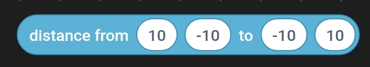
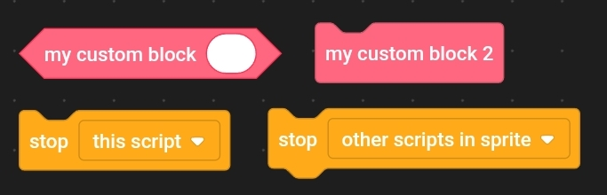

# Shapes of Blocks in `pmp_manip`

### STATEMENT
Example: `"&variables::change [VARIABLE] by (VALUE)"` 

### ENDING_STATEMENT
Example: `"&control::delete this clone"` 

### HAT
Example: `"&events::when green flag clicked"` 

### STRING_REPORTER
Example: `"&operators::join (STRING1) (STRING2)"` 

### NUMBER_REPORTER
Example: `"&sensing::distance from (X1) (Y1) to (X2) (Y2)"` 

### BOOLEAN_REPORTER
Example: `"&sensing::key ([KEY]) pressed?"` 

### DYNAMIC
Used for blocks, which can change shape depending on e.g. dropdown values or other blocks.
Can only become one of the above. 
Example: `"&customblocks::call custom block"` and `"&control::stop script [TARGET]"` 

### EMBEDDED
Used only for blocks, which can not exist on their own. The only current use case is the deprecated polygon menu in the pen extension.
### MENU
Used in first representation in some block dropdowns to store a single value. Blocks of this shape never exist in second representation.
### NOT_RELEVANT
Used in first representation in boolean inputs and custom block definitions. Blocks of this shape never exist in second representation.

---

### References
* For a **documentation overview** and a **broader usage tutorial**, see [docs/index.md](index.md)

