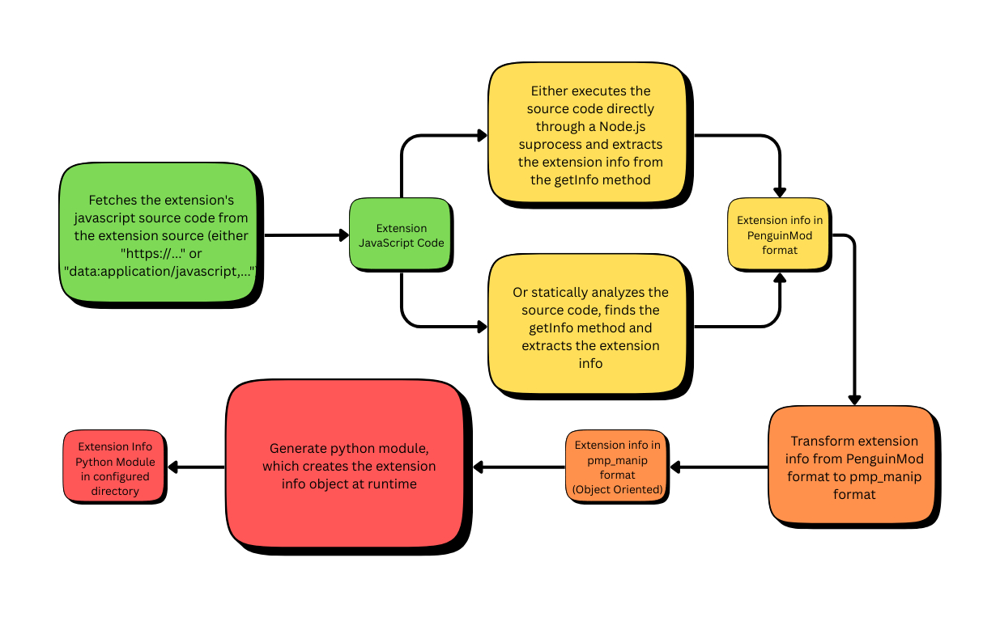

# Handling Builtin and Custom Extensions in `pmp_manip`

The core functionality of the `pmp_manip` project relies on **block opcode information** to process and manipulate blocks.
However, **Custom** and **Builtin** extensions can create blocks that `pmp_manip` does not recognize by default.

---

## Adding Extensions manually

If you want to convert a project, which uses an extension, such as Scratch’s **music extension**, you must explicitly add it to the `info_api`.

**Example without adding the extension (will fail):**

```python
from pmp_manip import get_default_config, init_config, FRProject, info_api

# Init the required configuration
cfg = get_default_config()
init_config(cfg)

frproject = FRProject.from_file(file_path="path/to/my_music_project.pmp")
srproject = frproject.to_second(info_api)
print("Project was converted successfully :)")
```

**Result:**

```
pmp_manip.utility.errors.MANIP_UnknownOpcodeError: Could not find OpcodeInfo by old opcode 'music_playDrumForBeats'. Have you possibly forgotten to add an extension?
```
This error occurs because that project uses Scratch's **music extension** and `info_api`(the api managing info about block opcodes) does not include the **music extension** by default. You need to explicitly add it.

---

### Addind Extensions manually

```python
from pmp_manip import (
    get_default_config, init_config, FRProject,
    info_api,
)

cfg = get_default_config()
init_config(cfg)

# Add the music extension
info_api.generate_and_add_extension(extension_id="music", extension_source=None) # Builtin extensions do not require a source

frproject = FRProject.from_file(file_path="path/to/my_music_project.pmp")
srproject = frproject.to_second(info_api)
print("Project was converted successfully :)")
```
For a custom extension however you would need a source:
```python
info_api.generate_and_add_extension(extension_id="numberUtilities", extension_source="https://extensions.penguinmod.com/extensions/MubiLop/numutils.js")
```

---

## Automatically Adding All Extensions

If you do not want to manually add extensions,
you can **automatically detect and add all required extensions** for a project.

```python
from pmp_manip import (
    get_default_config, init_config, FRProject,
    info_api,
)

cfg = get_default_config()
init_config(cfg)

# Load the project
frproject = FRProject.from_file(file_path="path/to/my_music_project.pmp")

# Automatically add all needed extensions
frproject.add_all_extensions_to_info_api(info_api)

# Use the project as usual
srproject = frproject.to_second(info_api)
print("Project was converted successfully :)")
```

**Notes:**

* `add_all_extensions_to_info_api` is available on both `FRProject` and `SRProject`.
* The **extension info generator** under the hood:
  
* [Configuration docs](config.md)
* [Configuration options](config.md#extinfogenconfig)

---

## Using a Custom Extension

For **custom extensions**, you can create and attach them manually.

```python
from pmp_manip import (
    get_default_config, init_config,
    SRProject, SRCustomExtension, SRScript, SRBlock,
    info_api,
)

cfg = get_default_config()
init_config(cfg)

# Create an empty project (you could use any other method too)
srproject = SRProject.create_empty()

# Add a custom extension from an untrusted source
srproject.extensions.append(SRCustomExtension(
    id="griffpatch", 
    url="https://tinyurl.com/griffpatch-extension",
))

# Add a script with a single custom block
srproject.stage.scripts.append(SRScript(
    position=(100, 100),
    blocks=[SRBlock(opcode="&griffpatch::gravity x")],
))

# Automatically add all required extensions
srproject.add_all_extensions_to_info_api(info_api)

modified_frproject = srproject.to_first(info_api)
print("Project was modified and converted into PenguinMod format successfully :)")
```

---

### Example Error for Untrusted Custom Extension

If the extension info generator **cannot statically analyze** the extension code (common for unconventional code),
you’ll see something like:

```bash
pmp_manip.utility.errors.MANIP_SafeExtensionInfoExtractionError: Error in extension 'griffpatch': Failed to extract extension info through safe analysis: Cannot extract extension information: Bad extension code format: getInfo method should return static value:
Unsupported member expression format:
  member_expression:
    identifier ('BlockType')
    property_identifier ('COMMAND')
You can choose to let the code execute directly, which is more likely to work. See https://github.com/GermanCodeEngineer/py-pmp-manip/blob/main/docs/handling_extensions.md
```

---

## Trusting a Custom Extension

If you trust the extension source (e.g., a known developer or a verified domain),
you can configure the extension info generator to treat it as trusted.

```python
from pmp_manip import (
    get_default_config, init_config,
    SRProject, SRCustomExtension, SRScript, SRBlock,
    info_api,
)

cfg = get_default_config()

# Define a trust handler
def is_trusted_handler(extension_source: str) -> bool:
    trusted_sources = [
        "https://tinyurl.com/griffpatch-extension",
        "https://my-website.com/myExt.js",
        # Example: extension code directly in Data URI format
        "data:base64;base64,Ly8gbXkgQ3VzdG9tIEpTIERhdGEgVVJJOg0KY29uc29sZS5sb2coIkhpIik7",
        "data:text/javascript,%28function%28Scratch%29%20%7B%0A%20%20%27use%20strict%27%3B%0A%0A%20%20if%20%28%21Scratch.extensions.unsandboxed%29%20%7B%0A%20%20%20%20throw%20new%20Error%28%27This%20Hello%20World%20example%20must%20run%20unsandboxed%27%29%3B%0A%20%20%7D%0A%0A%20%20class%20HelloWorld%20%7B%0A%20%20%20%20getInfo%28%29%20%7B%0A%20%20%20%20%20%20return%20%7B%0A%20%20%20%20%20%20%20%20id%3A%20%27helloworldunsandboxed%27%2C%0A%20%20%20%20%20%20%20%20name%3A%20%27Unsandboxed%20Hello%20World%27%2C%0A%20%20%20%20%20%20%20%20blocks%3A%20%5B%0A%20%20%20%20%20%20%20%20%20%20%7B%0A%20%20%20%20%20%20%20%20%20%20%20%20opcode%3A%20%27hello%27%2C%0A%20%20%20%20%20%20%20%20%20%20%20%20blockType%3A%20Scratch.BlockType.REPORTER%2C%0A%20%20%20%20%20%20%20%20%20%20%20%20text%3A%20%27Hello%21%27%0A%20%20%20%20%20%20%20%20%20%20%7D%0A%20%20%20%20%20%20%20%20%5D%0A%20%20%20%20%20%20%7D%3B%0A%20%20%20%20%7D%0A%20%20%20%20hello%28%29%20%7B%0A%20%20%20%20%20%20return%20%27World%21%27%3B%0A%20%20%20%20%7D%0A%20%20%7D%0A%20%20Scratch.extensions.register%28new%20HelloWorld%28%29%29%3B%0A%7D%29%28Scratch%29%3B",
    ]
    return extension_source in trusted_sources
    # Or, match by prefix
    # return extension_source.startswith("https://my-website.com/")

cfg.ext_info_gen.is_trusted_extension_origin_handler = is_trusted_handler
init_config(cfg)

# Create a project with the trusted extension
srproject = SRProject.create_empty()
srproject.extensions.append(SRCustomExtension(
    id="griffpatch", 
    url="https://tinyurl.com/griffpatch-extension",
))
srproject.stage.scripts.append(SRScript(
    position=(100, 100),
    blocks=[SRBlock(opcode="&griffpatch::gravity x")],
))

srproject.add_all_extensions_to_info_api(info_api)

modified_frproject = srproject.to_first(info_api)
print("Project was modified and converted into PenguinMod format successfully :)")
```

---

### References
* For a **documentation overview** and **all pages** of the tutorial, see [docs/index.md](index.md)
* Next Page: **Getting info on opcodes**, see [docs/doc_api.md](doc_api.md)
