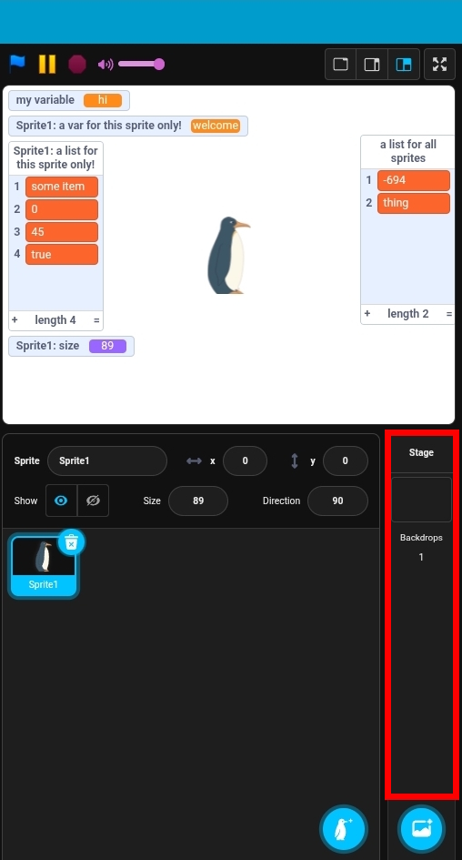

# Working with Second Representation in `pmp_manip`

## Project Structure:
This is the UML structure of a `SRProject`:


Let us compare an `SRProject` with it's view in the [PenguinMod Editor](https://studio.penguinmod.com/editor.html)

## Editor View vs. Project Object

### Editor View


### Project Object

```python
from pmp_manip import get_default_config, init_config, FRProject, info_api

cfg = get_default_config()
init_config(cfg)

frproject = FRProject.from_file(file_path="path/to/my_project.pmp")

srproject = frproject.to_second(info_api)
print("The contents of the project are:")
print(srproject)
```
Output(shortend):
```
The contents of the project are:
SRProject(
    stage=SRStage(
        scripts=[],
        comments=[
            SRComment(
                position=(244.16309497974535, 279.18415210865163),
                size=(200, 200),
                is_minimized=False,
                text="hi from a comment in the stage",
            ),
        ],
        ...
    ),
    sprites=[
        SRSprite(
            name="Sprite1",
            local_variables=[
                SRVariable(name="a var for this sprite only!", current_value="welcome"),
            ],
            local_lists=[
                SRList(name="a list for this sprite only!", current_value=["some item", 0, 45, True]),
            ],
            ...
    ],
    sprite_layer_stack=[
        UUID('da51ce38-832c-457b-84e6-372273438737'),
    ],
    global_variables=[
        SRVariable(name="my variable", current_value="hi"),
    ],
    global_lists=[
        SRList(name="a list for all sprites", current_value=[-694, "thing"]),
    ],
    tempo=60,
    video_transparency=50,
    video_state=SRVideoState.ON,
    text_to_speech_language=None,
    global_monitors=[
        SRVariableMonitor(
            readout_mode=SRVariableMonitorReadoutMode.NORMAL,
            slider_min=0,
            slider_max=100,
            allow_only_integers=True,
            opcode="value of [VARIABLE]",
            ...
        ),
        ...
    ],
    extensions=[],
)
```

## `SRProject`
The "root node" of a project in second representation
### `SRProject.stage`
- **type**: `SRSprite`(subclass of `SRTarget`)
- **content**: the stage of the project
- **editor view**: 


