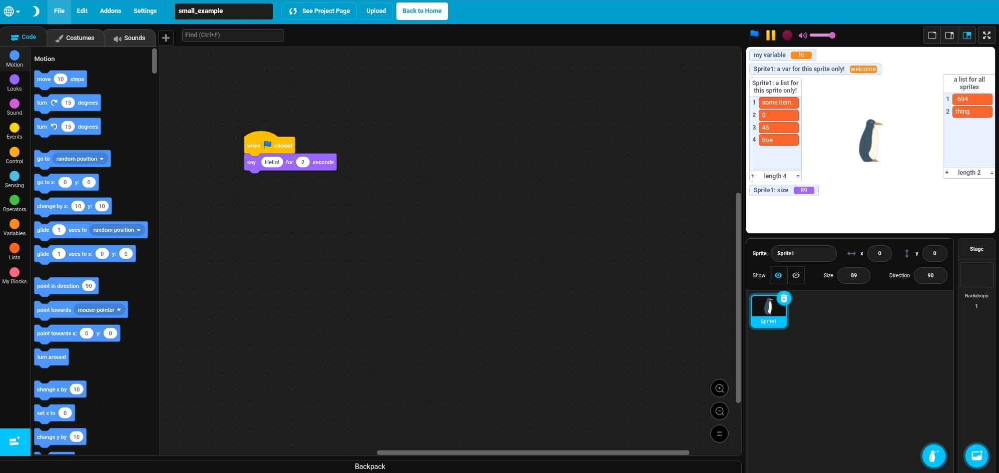

# Working with Second Representation in `pmp_manip`

## Project Structure:
This is the UML structure of a `SRProject`:


Let us compare an `SRProject` with it's view in the [PenguinMod Editor](https://studio.penguinmod.com/editor.html)

## Editor View vs. Project Object

### Editor View


### Project Object

```python
from pmp_manip import get_default_config, init_config, FRProject, info_api

cfg = get_default_config()
init_config(cfg)

frproject = FRProject.from_file(file_path="path/to/my_project.pmp")

srproject = frproject.to_second(info_api)
print("The contents of the project are:")
print(srproject)
```
Output(shortend):
```

```

Notes:
* I highly recommend to use a good code editor (especially VSCode), because you might want to look at the definition of e.g. a function/method or class(`Alt` + `Left Mouse Click`)
* All listed properties and can be read, set and modified if not specified otherwise.
* Most classes are dataclasses (specified if not), which implement these features:
    - Initialization (call class with all its properties set (listed below)) (e.g. `SRVariable(name="my variable", current_value=5)`)
    - Comparison (`==`)
    - Mutability (most, a few specified ones are immutable and hashable)
    - Validation (`validate` method, it is recommended to just validate the `SRProject` as a whole => easiest, you will not need to pass in anything but `info_api`)
    - Conversion (most, with `to_first` methods, it is recommended to just convert the project as a whole)


## `SRProject`
The "root node" of a project in second representation.
#### `SRProject.stage`
- **type**: [`SRStage`](#srstage)(subclass of [`SRTarget`](#srtarget))
- **description**: The stage of the project.
#### `SRProject.sprites`
- **type**: `list` of [`SRSprite`](#srsprite)(subclass of [`SRTarget`](#srtarget))
- **description**: The sprites of the project, excluding the stage.
#### `SRProject.sprite_layer_stack`
- **type**: `list` of `UUID`(from package `uuid`)
- **description**: The order of sprites on the stage. Must contain all sprite UUIDs([`SRSprite.uuid`](#srspriteuuid)) in any order. Last UUID means sprite is on the highest layer and is rendered on top of all other sprites. First UUID means lowest layer.
#### `SRProject.global_variables`
- **type**: `list` of [`SRVariable`](#srvariable)
- **description**: The names and values of the "for all sprites" variables of the project. Local Variables are stored in specific sprites, see [`SRSprite.local_variables`](#srspritelocal_variables).
#### `SRProject.global_lists`
- **type**: `list` of [`SRList`](#srlist)
- **description**: The names and values of the "for all sprites" lists of the project. Local Lists are stored in specific sprites, see [`SRSprite.local_lists`](#srspritelocal_lists)
#### `SRProject.global_monitors`
- **type**: `list` of [`SRMonitor`](#srmonitor), [`SRVariableMonitor`](#srvariablemonitor)(subclass) and [`SRListMonitor`](#srlistmonitor)(subclass)
- **description**: The non-sprite-specific monitors of blocks shown or once shown on the stage. Local Monitors are stored in specific sprites, see [`SRSprite.local_monitors`](#srspritelocal_monitors).
#### `SRProject.extensions`
- **type**: `list` of [`SRBuiltinExtension`](#srbuiltinextension) or [`SRCustomExtension`](#srcustomextension), see [`SRExtension`](#srextension)(parent class)
- **description**: Stores the ids and possibly urls/sources of all added extensions.
### *`SRProject.tempo`*
- **type**: `int` (minimum: `20`, maximum: `500`)
- **description**: The music "tempo" of Scratch's Music extension in BPM (insignificant for most projects).
- **note**: Equal to value of "tempo" block.
- **default value**: `60`
### *`SRProject.video_transparency`*
- **type**: `int` or `float` (normally between `0` and `100`) (seems not to have limits by Scratch)
- **description**: The "video transparency" of Scratch's Video Sensing extension (insignificant for most projects).
- **note**: Equal to input of "set video transparency to" block.
- **default value**: `50`
### *`SRProject.video_state`*
- **type**: `SRVideoState` (enum class)
- **possible values**: `SRVideoState.ON`, `SRVideoState.ON_FLIPPED`, `SRVideoState.OFF`
- **description**: The "state" of Scratch's Video Sensing extension (insignificant for most projects).
- **note**: Equal to dropdown menu of "turn video ..." block.
- **default value**: `SRVideoState.ON`
### *`SRProject.text_to_speech_language`*
- **type**: [`SRTTSLanguage`](#srttslanguage) (enum class) or `None`
- **possible values**: `SRTTSLanguage.ENGLISH`, `SRTTSLanguage.FRENCH`, `SRTTSLanguage.GERMAN` ...
- **description**: The "text to speech language" of Scratch's TTS extension (insignificant for most projects).
- **note**: Equal to dropdown menu of "set language to" block.
- **default value**: `None`


## `SRTarget`
Common base for [`SRStage`](#srstage) and [`SRSprite`](#srsprite).
#### `SRTarget.scripts`
- **type**: `list` of [`SRScript`](#srscript)
- **description**: Stores all the blocks and attached comments in a sprite or the stage.
#### `SRTarget.comments`
- **type**: `list` of [`SRComment`](#srcomment)
- **description**: Stores all the comments, which are not attached to a block, in a sprite or the stage.
#### `SRTarget.costumes`
- **type**: `list` of [`SRVectorCostume`](#srvectorcostume) or [`SRBitmapCostume`](srbitmapcostume), see [`SRCostume`](#srcostume)(parent class)
- **description**: Stores all the costumes of a sprite or stage.
- **note**: Must have at least one costume(hint: use `SRVectorCostume.create_empty` for an empty default costume)
#### `SRTarget.sounds`
- **type**: `list` of [`SRSound`](#srsound)
- **description**: Stores all the sounds of a sprite or stage.
#### `SRTarget.costume_index`
- **type**: `int` (at least `0` and at most one less then the amount of costumes)
- **description**: References the current costume of the sprite or stage in `costumes` by index.
- **default value**: `0`
#### `SRTarget.volume`
- **type**: `int` (minimum: `0`, maximum: `100`)
- **description**: The local volume for playing sounds from a sprite or stage.
- **default value**: `100`


## `SRStage`
Represents the project stage. Inherits from [`SRTarget`](#srtarget).
Has no additional properties compared to `SRTarget`, as all global information is stored on the project directly.


## `SRSprite`
Represents a sprite of the project. Inherits from [`SRTarget`](#srtarget).
#### `SRSprite.name`
- **type**: `str` (Blacklist: `"_myself_"`, `"_stage_"`, `"_mouse_"`, `"_edge_"`)
- **description**: The name of the sprite.
#### `SRSprite.local_variables`
- **type**: `list` of [`SRVariable`](#srvariable)
- **description**: The names and values of the "for this sprite only" variables of the sprite. Global Variables are stored in the project directly, see [`SRProject.global_variables`](#srprojectglobal_variables).
#### `SRSprite.local_lists`
- **type**: `list` of [`SRList`](#srlist)
- **description**: The names and values of the "for this sprite only" lists of the sprite. Global Lists are stored in the project directly, see [`SRProject.global_lists`](#srprojectglobal_lists).
#### `SRSprite.is_visible`
- **type**: `bool`
- **description**: Stores wether the sprite is shown on the stage.
- **default value**: `True`
#### `SRSprite.position`
- **type**: `tuple` of `int|float`(x position) and `int|float`(y position)
- **description**: Stores the position of the sprite on the stage. If the stage size was not changed, should be between `(-240, -180)` to `(240, 180)` (no enforced limit).
- **default value**: random
#### `SRSprite.size`
- **type**: `int | float` (positive)
- **description**: Stores the size of the sprite on the stage.
- **default value**: `100`
#### `SRSprite.direction`
- **type**: `int | float` (minimum: `-180`, maximum: `-180`)
- **description**: Stores the rotation direction of the sprite on the stage.
- **default value**: `90` (Up: `0`, Right: `90`, Down: `180`, Left: `-90`)
#### `SRSprite.is_draggable`
- **type**: `bool`
- **description**: Stores wether the sprite can be dragged across the stage in fullscreen mode.
- **default value**: `False`
#### `SRSprite.rotation_style`
- **type**: `SRSpriteRotationStyle` (enum class)
- **possible values**: `SRSpriteRotationStyle.ALL_AROUND`, `SRSpriteRotationStyle.LEFT_RIGHT`, `SRSpriteRotationStyle.DONT_ROTATE`
- **description**: The way the sprite behaves when rotated.
- **default value**: `SRSpriteRotationStyle.ALL_AROUND`
#### `SRSprite.uuid`
- **type**: `UUID`(from package `uuid`)
- **description**: A unique id for the sprite. Only used for [`SRProject.sprite_layer_stack`](#srprojectsprite_layer_stack).
- **note**: **Read-only.** Can not be modified and can not be passed to `SRSprite` at Creation/Initialization, but is automatically set.


## `SRVariable`
Represents a "for all sprites"(global) or "for this sprite only"(local) variable.
#### `SRVariable.name`
- **type**: `str`
- **description**: The name of the variable.
#### `SRVariable.current_value`
- **type**: usually `int`, `float` or `str`, but technically `bool` too (e.g. Infinity is saved as 0).
- **description**: The current value of the variable.


## `SRList`
Represents a "for all sprites"(global) or "for this sprite only"(local) list.
#### `SRList.name`
- **type**: `str`
- **description**: The name of the list.
#### `SRList.current_value`
- **type**: `list` of usually `int`, `float` and `str`, but technically `bool` too (e.g. Infinity is saved as 0).
- **description**: The current value of the list.


## `SRMonitor`
Represents a non-sprite-specific(global) or sprite-specific(local) monitor. Also is basis for [`SRVariableMonitor`](#srvariablemonitor)(subclass) and [`SRListMonitor`](#srlistmonitor)(subclass)
#### `SRMonitor.opcode`
- **type**: `str`
- **description**: The "opcode"(unique identifier) of the block, the monitor is for (see [`SRBlock.opcode`](#srblockopcode)).
#### `SRMonitor.dropdowns`
- **type**: `dict` of `str` keys and `SRDropdownValue` values
- **description**: the exact dropdown settings of the monitor (e.g. "costume number/name" block). Based on the dropdowns of the block (see [`SRBlock.dropdowns`](#srblockdropdowns)).
#### `SRMonitor.position`
- **type**: `tuple` of `int|float`(x position) and `int|float`(y position)
- **description**: Stores the position of the monitor on the stage. If the stage size was not changed, should be between `(-240, -180)` to `(240, 180)` (no enforced limit).
- **note**: You should change validation configuration to tolerant if you work with other stage sizes (See [config.md, section ValidationConfig](config.md#validationconfig)).
#### `SRMonitor.is_visible`
- **type**: `bool`
- **description**: Stores wether the monitor is currently shown on the stage.


## `SRVariableMonitor`
Represents the monitor of a **variable value block** of a global or local variable. Inherits from [`SRMonitor`](#srmonitor).
#### `SRVariableMonitor.readout_mode`
- **type**: `SRVariableMonitorReadoutMode` (enum class)
- **possible values**: `SRVariableMonitorReadoutMode.NORMAL`, `SRVariableMonitorReadoutMode.LARGE`, `SRVariableMonitorReadoutMode.SLIDER`
- **description**: Stores how a variable monitors is shown(e.g. only content(=`LARGE`), name and content(=`NORMAL`), with a slider to change value(=`SLIDER`))
- **default value**: `SRVariableMonitorReadoutMode.NORMAL`
#### `SRVariableMonitor.slider_min`
- **type**: `int | float`
- **description**: If [`readout_mode`](#srvariablemonitorreadout_mode) is `SLIDER`, the minimum value you can drag the slider to.
- **default value**: `0`
#### `SRVariableMonitor.slider_max`
- **type**: `int | float`
- **description**: If [`readout_mode`](#srvariablemonitorreadout_mode) is `SLIDER`, the maximum value you can drag the slider to.
- **default value**: `100`
#### `SRVariableMonitor.allow_only_integers`
- **type**: `bool`
- **description**: If [`readout_mode`](#srvariablemonitorreadout_mode) is `SLIDER`, wether you can drag the slider to a non-integer value.
- **note**: is set in Scratch based on wether you enter a floating point value into either the slider minimum or maximum.
- **default value**: `True`


## `SRListMonitor`
Represents the monitor of a **list value block** of a global or local list. Inherits from [`SRMonitor`](#srmonitor).
#### `SRListMonitor.size`
- **type**: `tuple` of `int|float`(width) and `int|float`(height)
- **description**: Stores the size of a list monitor as it can be resized.
- **note**: You should change validation configuration to tolerant if you work with other stage sizes (See [config.md, section ValidationConfig](config.md#validationconfig)).
- **default value**: `(100, 120)`


