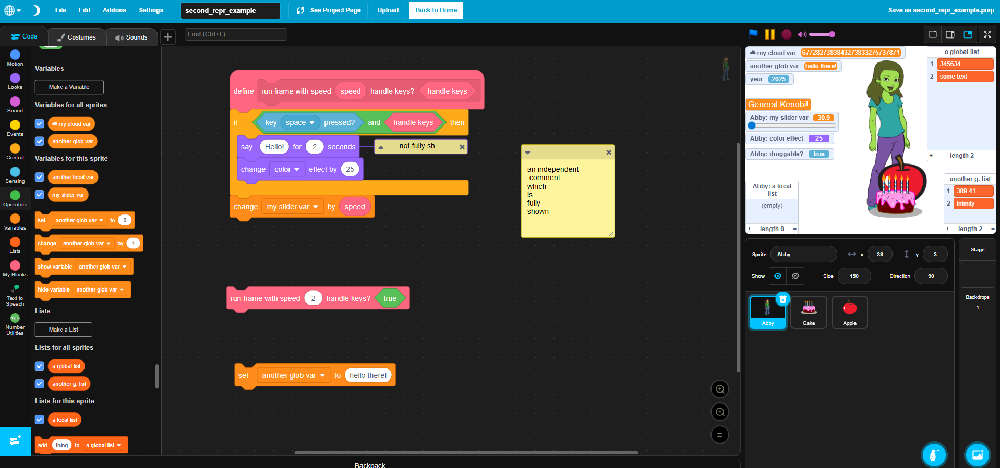
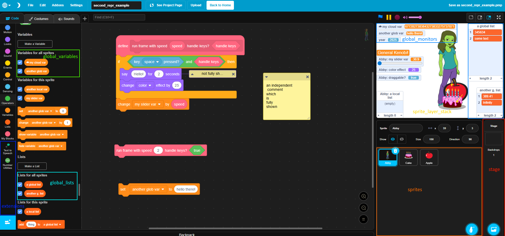
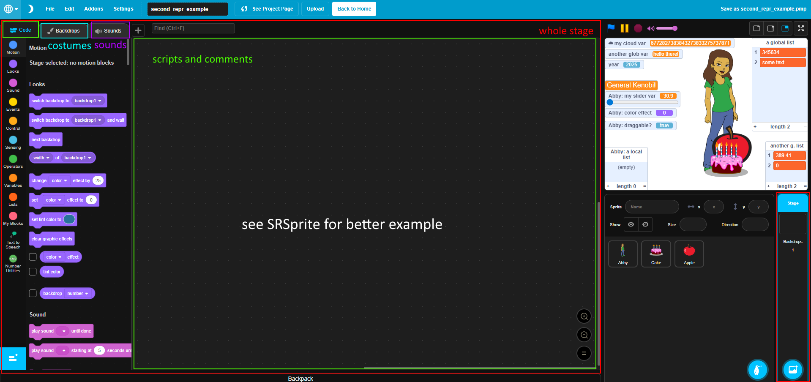
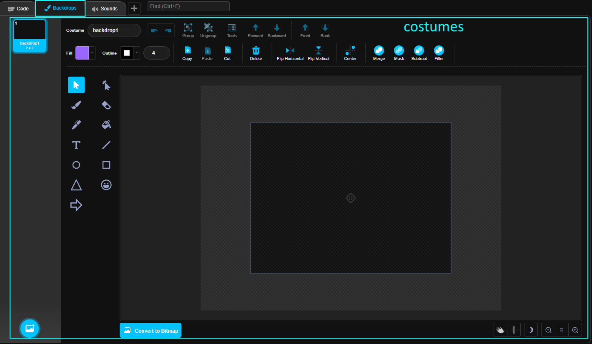
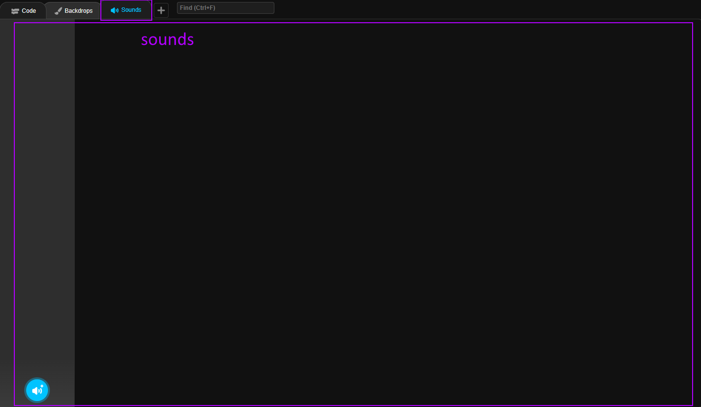
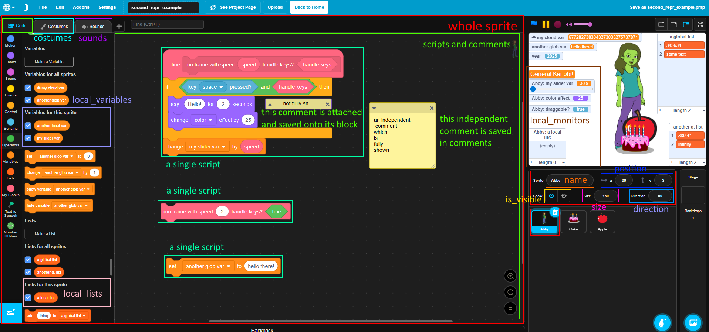
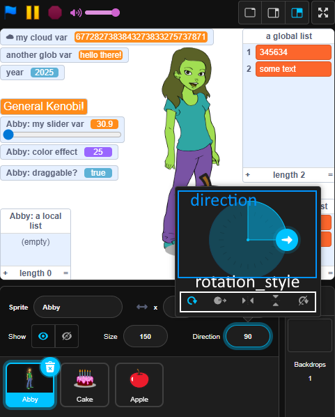
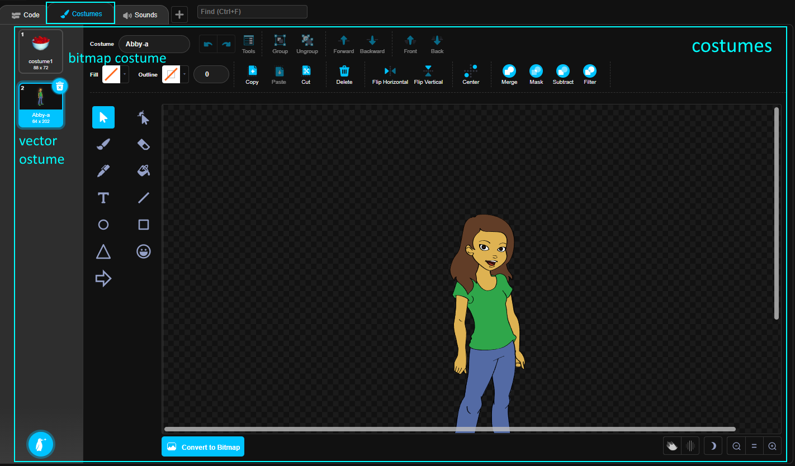
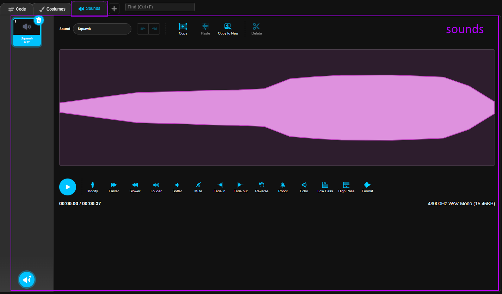

# Working with Second Representation in `pmp_manip`

## Project Structure:
This is the UML structure of a `SRProject`:


Let us compare an `SRProject` with it's view in the [PenguinMod Editor](https://studio.penguinmod.com/editor.html)

## Editor View vs. Python Object

### Editor View


### Python Object

```python
from pmp_manip import get_default_config, init_config, FRProject, info_api

cfg = get_default_config()
init_config(cfg)

frproject = FRProject.from_file(file_path="path/to/my_project.pmp")
frproject.add_all_extensions_to_info_api(info_api)

srproject = frproject.to_second(info_api)
print("The contents of the project are:")
print(srproject)
```
Note: `add_all_extensions_to_info_api` is discussed later in the tutorial

Output:
```lua
The contents of the project are:
SRProject(
    stage=SRStage(
        scripts=[],
        comments=[],
        costumes=[
            SRVectorCostume(
                content=<Element {http://www.w3.org/2000/svg}svg at 0x7820d9c840>,
                name="backdrop1",
                file_extension="svg",
                rotation_center=(240, 180),
            ),
        ],
        sounds=[],
        costume_index=0,
        volume=100,
    ),
    sprites=[
        SRSprite(
            name="Abby",
            local_variables=[
                SRVariable(name="my slider var", current_value=30.9),
                SRVariable(name="another local var", current_value="General Kenobi!"),
            ],
            local_lists=[
                SRList(name="a local list", current_value=[]),
            ],
            local_monitors=[
                SRMonitor(
                    opcode="draggable?",
                    dropdowns={},
                    position=(-240, 16),
                    is_visible=True,
                ),
                SRVariableMonitor(
                    readout_mode=SRVariableMonitorReadoutMode.SLIDER,
                    slider_min=30.9,
                    slider_max=100,
                    allow_only_integers=False,
                    opcode="value of [VARIABLE]",
                    dropdowns={
                        "VARIABLE": SRDropdownValue(kind=DropdownValueKind.VARIABLE, value="my slider var"),
                    },
                    position=(-240, -54),
                    is_visible=True,
                ),
                SRMonitor(
                    opcode="[EFFECT] sprite effect",
                    dropdowns={
                        "EFFECT": SRDropdownValue(kind=DropdownValueKind.STANDARD, value="color"),
                    },
                    position=(-240, -14),
                    is_visible=True,
                ),
                SRVariableMonitor(
                    readout_mode=SRVariableMonitorReadoutMode.LARGE,
                    slider_min=0,
                    slider_max=100,
                    allow_only_integers=True,
                    opcode="value of [VARIABLE]",
                    dropdowns={
                        "VARIABLE": SRDropdownValue(kind=DropdownValueKind.VARIABLE, value="another local var"),
                    },
                    position=(-240, -80),
                    is_visible=True,
                ),
                SRListMonitor(
                    size=(100, 102),
                    opcode="value of [LIST]",
                    dropdowns={
                        "LIST": SRDropdownValue(kind=DropdownValueKind.LIST, value="a local list"),
                    },
                    position=(-240, 78),
                    is_visible=True,
                ),
            ],
            is_visible=True,
            position=(39, 3),
            size=150,
            direction=90,
            is_draggable=True,
            uuid=UUID('a1e32a92-36fa-4a45-bc2e-9c1eca536a30'),
            scripts=[
                SRScript(
                    position=(235, 79),
                    blocks=[
                        SRBlock(
                            opcode="define custom block",
                            inputs={},
                            dropdowns={},
                            comment=None,
                            mutation=SRCustomBlockMutation(
                                custom_opcode=SRCustomBlockOpcode(
                                    segments=(
                                        "run frame with speed",
                                        SRCustomBlockArgument(name="speed", type=SRCustomBlockArgumentType.STRING_NUMBER),
                                        "handle keys?",
                                        SRCustomBlockArgument(name="handle keys", type=SRCustomBlockArgumentType.BOOLEAN),
                                    ),
                                ),
                                no_screen_refresh=True,
                                optype=SRCustomBlockOptype.STATEMENT,
                                main_color="#FF6680",
                                prototype_color="#e65c73",
                                outline_color="#cc5266",
                            ),
                        ),
                        SRBlock(
                            opcode="if <CONDITION> then {THEN}",
                            inputs={
                                "CONDITION": SRBlockAndBoolInputValue(
                                    block=SRBlock(
                                        opcode="<OPERAND1> and <OPERAND2>",
                                        inputs={
                                            "OPERAND1": SRBlockAndBoolInputValue(
                                                block=SRBlock(
                                                    opcode="key ([KEY]) pressed?",
                                                    inputs={
                                                        "KEY": SRBlockAndDropdownInputValue(
                                                            block=None,
                                                            dropdown=SRDropdownValue(kind=DropdownValueKind.STANDARD, value="space"),
                                                        ),
                                                    },
                                                    dropdowns={},
                                                    comment=None,
                                                    mutation=None,
                                                ),
                                                immediate=False,
                                            ),
                                            "OPERAND2": SRBlockAndBoolInputValue(
                                                block=SRBlock(
                                                    opcode="custom block boolean arg [ARGUMENT]",
                                                    inputs={},
                                                    dropdowns={},
                                                    comment=None,
                                                    mutation=SRCustomBlockArgumentMutation(
                                                        argument_name="handle keys",
                                                        main_color="#FF6680",
                                                        prototype_color="#e65c73",
                                                        outline_color="#cc5266",
                                                    ),
                                                ),
                                                immediate=True,
                                            ),
                                        },
                                        dropdowns={},
                                        comment=None,
                                        mutation=None,
                                    ),
                                    immediate=False,
                                ),
                                "THEN": SRScriptInputValue(
                                    blocks=[
                                        SRBlock(
                                            opcode="say (MESSAGE) for (SECONDS) seconds",
                                            inputs={
                                                "MESSAGE": SRBlockAndTextInputValue(block=None, immediate="Hello!"),
                                                "SECONDS": SRBlockAndTextInputValue(block=None, immediate="2"),
                                            },
                                            dropdowns={},
                                            comment=SRComment(
                                                position=(544.2964344861196, 207.30042684993646),
                                                size=(200, 200),
                                                is_minimized=True,
                                                text="not fully\nshown",
                                            ),
                                            mutation=None,
                                        ),
                                        SRBlock(
                                            opcode="change [EFFECT] sprite effect by (AMOUNT)",
                                            inputs={
                                                "AMOUNT": SRBlockAndTextInputValue(block=None, immediate="25"),
                                            },
                                            dropdowns={
                                                "EFFECT": SRDropdownValue(kind=DropdownValueKind.STANDARD, value="color"),
                                            },
                                            comment=None,
                                            mutation=None,
                                        ),
                                    ],
                                ),
                            },
                            dropdowns={},
                            comment=None,
                            mutation=None,
                        ),
                    ],
                ),
                SRScript(
                    position=(257, 714),
                    blocks=[
                        SRBlock(
                            opcode="set [VARIABLE] to (VALUE)",
                            inputs={
                                "VALUE": SRBlockAndTextInputValue(block=None, immediate="hello there!"),
                            },
                            dropdowns={
                                "VARIABLE": SRDropdownValue(kind=DropdownValueKind.VARIABLE, value="another glob var"),
                            },
                            comment=None,
                            mutation=None,
                        ),
                    ],
                ),
                SRScript(
                    position=(240, 549),
                    blocks=[
                        SRBlock(
                            opcode="call custom block",
                            inputs={
                                "speed": SRBlockAndTextInputValue(block=None, immediate="2"),
                                "handle keys": SRBlockAndBoolInputValue(
                                    block=SRBlock(
                                        opcode="true",
                                        inputs={},
                                        dropdowns={},
                                        comment=None,
                                        mutation=None,
                                    ),
                                    immediate=False,
                                ),
                            },
                            dropdowns={},
                            comment=None,
                            mutation=SRCustomBlockCallMutation(
                                custom_opcode=SRCustomBlockOpcode(
                                    segments=(
                                        "run frame with speed",
                                        SRCustomBlockArgument(name="speed", type=SRCustomBlockArgumentType.STRING_NUMBER),
                                        "handle keys?",
                                        SRCustomBlockArgument(name="handle keys", type=SRCustomBlockArgumentType.BOOLEAN),
                                    ),
                                ),
                            ),
                        ),
                    ],
                ),
            ],
            comments=[
                SRComment(
                    position=(870, 244),
                    size=(200, 200),
                    is_minimized=False,
                    text="an independent\n comment\nwhich\nis\nfully\nshown",
                ),
            ],
            costumes=[
                SRBitmapCostume(
                    content=<PIL.PngImagePlugin.PngImageFile image mode=P size=176x144 at 0x781e6b60c0>,
                    has_double_resolution=True,
                    name="costume1",
                    file_extension="png",
                    rotation_center=(88, 72),
                ),
                SRVectorCostume(
                    content=<Element {http://www.w3.org/2000/svg}svg at 0x781e6c4200>,
                    name="Abby-a",
                    file_extension="svg",
                    rotation_center=(31, 100),
                ),
            ],
            sounds=[
                SRSound(name="Squawk", file_extension="wav", content=<pydub.audio_segment.AudioSegment object at 0x781e6bce90>),
            ],
            costume_index=1,
            volume=100,
        ),
        SRSprite(
            name="Cake",
            local_variables=[],
            local_lists=[],
            local_monitors=[],
            is_visible=True,
            position=(47.88235294117649, -104.70588235294117),
            size=80,
            direction=90,
            is_draggable=False,
            uuid=UUID('9ea54f86-9f2a-4f8b-ab0d-3f5870004020'),
            scripts=[],
            comments=[],
            costumes=[
                SRVectorCostume(
                    content=<Element {http://www.w3.org/2000/svg}svg at 0x781ed7be80>,
                    name="cake-a",
                    file_extension="svg",
                    rotation_center=(64, 50),
                ),
            ],
            sounds=[
                SRSound(name="Birthday", file_extension="wav", content=<pydub.audio_segment.AudioSegment object at 0x781e68b8c0>),
            ],
            costume_index=0,
            volume=100,
        ),
        SRSprite(
            name="Apple",
            local_variables=[],
            local_lists=[],
            local_monitors=[],
            is_visible=True,
            position=(60.58823529411765, -73.47058823529413),
            size=150,
            direction=90,
            is_draggable=False,
            uuid=UUID('1026712f-651e-43a1-9456-cf22e4555990'),
            scripts=[],
            comments=[],
            costumes=[
                SRVectorCostume(
                    content=<Element {http://www.w3.org/2000/svg}svg at 0x781e6b6d80>,
                    name="Apple",
                    file_extension="svg",
                    rotation_center=(31, 31),
                ),
            ],
            sounds=[],
            costume_index=0,
            volume=100,
        ),
    ],
    sprite_layer_stack=[
        UUID('a1e32a92-36fa-4a45-bc2e-9c1eca536a30'),
        UUID('1026712f-651e-43a1-9456-cf22e4555990'),
        UUID('9ea54f86-9f2a-4f8b-ab0d-3f5870004020'),
    ],
    global_variables=[
        SRVariable(name="another glob var", current_value="hello there!"),
        SRCloudVariable(name="☁ my cloud var", current_value="6772827383843273833275737871"),
    ],
    global_lists=[
        SRList(name="a global list", current_value=[345634, "some text"]),
        SRList(name="another g. list", current_value=[389.41, 0]),
    ],
    global_monitors=[
        SRVariableMonitor(
            readout_mode=SRVariableMonitorReadoutMode.NORMAL,
            slider_min=0,
            slider_max=100,
            allow_only_integers=True,
            opcode="value of [VARIABLE]",
            dropdowns={
                "VARIABLE": SRDropdownValue(kind=DropdownValueKind.VARIABLE, value="another glob var"),
            },
            position=(-240, -153),
            is_visible=True,
        ),
        SRVariableMonitor(
            readout_mode=SRVariableMonitorReadoutMode.NORMAL,
            slider_min=0,
            slider_max=100,
            allow_only_integers=True,
            opcode="value of [VARIABLE]",
            dropdowns={
                "VARIABLE": SRDropdownValue(kind=DropdownValueKind.VARIABLE, value="☁ my cloud var"),
            },
            position=(-240, -180),
            is_visible=True,
        ),
        SRListMonitor(
            size=(132, 219),
            opcode="value of [LIST]",
            dropdowns={
                "LIST": SRDropdownValue(kind=DropdownValueKind.LIST, value="a global list"),
            },
            position=(108, -180),
            is_visible=True,
        ),
        SRListMonitor(
            size=(100, 116),
            opcode="value of [LIST]",
            dropdowns={
                "LIST": SRDropdownValue(kind=DropdownValueKind.LIST, value="another g. list"),
            },
            position=(140, 64),
            is_visible=True,
        ),
        SRMonitor(
            opcode="answer",
            dropdowns={},
            position=(-235, -25),
            is_visible=False,
        ),
        SRMonitor(
            opcode="current [PROPERTY]",
            dropdowns={
                "PROPERTY": SRDropdownValue(kind=DropdownValueKind.STANDARD, value="year"),
            },
            position=(-240, -128),
            is_visible=True,
        ),
        SRMonitor(
            opcode="timer",
            dropdowns={},
            position=(-240, -104),
            is_visible=False,
        ),
    ],
    extensions=[
        SRBuiltinExtension(id="text2speech"),
        SRCustomExtension(url="https://extensions.penguinmod.com/extensions/MubiLop/numutils.js", id="numberUtilities"),
    ],
    tempo=60,
    video_transparency=50,
    video_state=SRVideoState.ON,
    text_to_speech_language=SRTTSLanguage.ENGLISH,
)
```
\# TODO: shorten

Notes:
* I highly recommend to use a good code editor (especially VSCode), because you might want to look at the definition of e.g. a function/method or class(`Alt` + `Left Mouse Click`)
* All listed properties and can be read, set and modified if not specified otherwise.
* Most classes are dataclasses (specified if not), which implement these features:
    - Initialization (call class with all its properties set (listed below)) (e.g. `SRVariable(name="my variable", current_value=5)`)
    - Comparison (`==`)
    - Mutability (most, a few specified ones are immutable and hashable)
    - Validation (`validate` method, it is recommended to just validate the `SRProject` as a whole => easiest, you will not need to pass in anything but `info_api`)
    - Conversion (most, with `to_first` methods, it is recommended to just convert the project as a whole)
    - Nice Representation (defines a readable `__repr__`)
    - Sorting (e.g. a `list[SomeSRThing]`)


## `SRProject`
The "root node" of a project in second representation.
#### `SRProject.stage`
- **type**: [`SRStage`](#srstage)(subclass of [`SRTarget`](#srtarget))
- **description**: The stage of the project.
#### `SRProject.sprites`
- **type**: `list` of [`SRSprite`](#srsprite)(subclass of [`SRTarget`](#srtarget))
- **description**: The sprites of the project, excluding the stage.
#### `SRProject.sprite_layer_stack`
- **type**: `list` of `UUID`(from package `uuid`)
- **description**: The order of sprites on the stage. Must contain all sprite UUIDs([`SRSprite.uuid`](#srspriteuuid)) in any order. Last UUID means sprite is on the highest layer and is rendered on top of all other sprites. First UUID means lowest layer.
#### `SRProject.global_variables`
- **type**: `list` of [`SRVariable`](#srvariable) or [`SRCloudVariable`](#srcloudvariable)(subclass)
- **description**: The names and values of the "for all sprites" variables of the project. Local Variables are stored in specific sprites, see [`SRSprite.local_variables`](#srspritelocal_variables).
#### `SRProject.global_lists`
- **type**: `list` of [`SRList`](#srlist)
- **description**: The names and values of the "for all sprites" lists of the project. Local Lists are stored in specific sprites, see [`SRSprite.local_lists`](#srspritelocal_lists)
#### `SRProject.global_monitors`
- **type**: `list` of [`SRMonitor`](#srmonitor), [`SRVariableMonitor`](#srvariablemonitor)(subclass) and [`SRListMonitor`](#srlistmonitor)(subclass)
- **description**: The non-sprite-specific monitors of blocks shown or once shown on the stage. Local Monitors are stored in specific sprites, see [`SRSprite.local_monitors`](#srspritelocal_monitors).
#### `SRProject.extensions`
- **type**: `list` of [`SRBuiltinExtension`](#srbuiltinextension) or [`SRCustomExtension`](#srcustomextension), see [`SRExtension`](#srextension)(parent class)
- **description**: Stores the ids and possibly urls/sources of all added extensions.
#### *`SRProject.tempo`*
- **type**: `int` (minimum: `20`, maximum: `500`)
- **description**: The music "tempo" of Scratch's Music extension in BPM (insignificant for most projects).
- **note**: Equal to value of "tempo" block.
- **default value in editor**: `60`
#### *`SRProject.video_transparency`*
- **type**: `int` or `float` (normally between `0` and `100`) (seems not to have limits by Scratch)
- **description**: The "video transparency" of Scratch's Video Sensing extension (insignificant for most projects).
- **note**: Equal to input of "set video transparency to" block.
- **default value in editor**: `50`
#### *`SRProject.video_state`*
- **type**: `SRVideoState` (enum class)
- **possible values**: `SRVideoState.ON`, `SRVideoState.ON_FLIPPED`, `SRVideoState.OFF`
- **description**: The "state" of Scratch's Video Sensing extension (insignificant for most projects).
- **note**: Equal to dropdown menu of "turn video ..." block.
- **default value in editor**: `SRVideoState.ON`
#### *`SRProject.text_to_speech_language`*
- **type**: [`SRTTSLanguage`](#srttslanguage) (enum class) or `None`
- **possible values**: `SRTTSLanguage.ENGLISH`, `SRTTSLanguage.FRENCH`, `SRTTSLanguage.GERMAN` ...
- **description**: The "text to speech language" of Scratch's TTS extension (insignificant for most projects).
- **note**: Equal to dropdown menu of "set language to" block.
- **default value in editor**: `None`
### Editor View Example

### Python Object Example
```lua
SRProject(
    stage=SRStage(
        # shortend here
    ),
    sprites=[
        SRSprite(
            name="Abby",
            uuid=UUID('a1e32a92-36fa-4a45-bc2e-9c1eca536a30'),
            # shortend here
        ),
        SRSprite(
            name="Cake",
            uuid=UUID('9ea54f86-9f2a-4f8b-ab0d-3f5870004020'),
            # shortend here
        ),
        SRSprite(
            name="Apple",
            uuid=UUID('1026712f-651e-43a1-9456-cf22e4555990'),
            # shortend here
        ),
    ],
    sprite_layer_stack=[
        UUID('a1e32a92-36fa-4a45-bc2e-9c1eca536a30'),
        UUID('1026712f-651e-43a1-9456-cf22e4555990'),
        UUID('9ea54f86-9f2a-4f8b-ab0d-3f5870004020'),
    ],
    global_variables=[
        SRVariable(name="another glob var", current_value="hello there!"),
        SRCloudVariable(name="☁ my cloud var", current_value="6772827383843273833275737871"),
    ],
    global_lists=[
        SRList(name="a global list", current_value=[345634, "some text"]),
        SRList(name="another g. list", current_value=[389.41, 0]),
    ],
    global_monitors=[
        SRVariableMonitor(
            readout_mode=SRVariableMonitorReadoutMode.NORMAL,
            slider_min=0,
            slider_max=100,
            allow_only_integers=True,
            opcode="value of [VARIABLE]",
            dropdowns={
                "VARIABLE": SRDropdownValue(kind=DropdownValueKind.VARIABLE, value="another glob var"),
            },
            position=(-240, -153),
            is_visible=True,
        ),
        # shortend here
    ],
    extensions=[
        SRBuiltinExtension(id="text2speech"),
        SRCustomExtension(url="https://extensions.penguinmod.com/extensions/MubiLop/numutils.js", id="numberUtilities"),
    ],
    tempo=60,
    video_transparency=50,
    video_state=SRVideoState.ON,
    text_to_speech_language=SRTTSLanguage.ENGLISH,
)
```
### Notes
* As we can see, all sprite UUIDs are contained in `sprite_layer_stack`. The order is different though. E.G. The "Cake" Sprite is on top of "Apple" in `sprite_layer_stack` but not in `sprites`.


## `SRTarget`
Common base for [`SRStage`](#srstage) and [`SRSprite`](#srsprite).
#### `SRTarget.scripts`
- **type**: `list` of [`SRScript`](#srscript)
- **description**: Stores all the blocks and attached comments in a sprite or the stage.
#### `SRTarget.comments`
- **type**: `list` of [`SRComment`](#srcomment)
- **description**: Stores all the comments, which are not attached to a block, in a sprite or the stage.
#### `SRTarget.costumes`
- **type**: `list` of [`SRVectorCostume`](#srvectorcostume) or [`SRBitmapCostume`](#srbitmapcostume), see [`SRCostume`](#srcostume)(parent class)
- **description**: Stores all the costumes of a sprite or stage.
- **note**: Must have at least one costume(hint: use `SRVectorCostume.create_empty` for an empty default costume)
#### `SRTarget.sounds`
- **type**: `list` of [`SRSound`](#srsound)
- **description**: Stores all the sounds of a sprite or stage.
#### `SRTarget.costume_index`
- **type**: `int` (at least `0` and at most one less then the amount of costumes)
- **description**: References the current costume of the sprite or stage in `costumes` by index.
- **default value in editor**: `0`
#### `SRTarget.volume`
- **type**: `int` (minimum: `0`, maximum: `100`)
- **description**: The local volume for playing sounds from a sprite or stage.
- **default value in editor**: `100`


## `SRStage`
Represents the project stage. Inherits from [`SRTarget`](#srtarget).
Has no additional properties compared to `SRTarget`, as all global information is stored on the project directly.
### Editor View Example



### Python Object Example
```lua
SRStage(
    scripts=[],
    comments=[],
    costumes=[
        SRVectorCostume(
            content=<Element {http://www.w3.org/2000/svg}svg at 0x7820d9c840>,
            name="backdrop1",
            file_extension="svg",
            rotation_center=(240, 180),
        ),
    ],
    sounds=[],
    costume_index=0,
    volume=100,
)
```
### Notes
* As we can see, the stage has no scripts, comments and sounds, just one costume/backdrop which is empty.
* This costume is also referenced by costume index as it is item `0`.
* For a better example, see [`SRSprite`'s Example](#editor-view-example-2).


## `SRSprite`
Represents a sprite of the project. Inherits from [`SRTarget`](#srtarget).
#### `SRSprite.name`
- **type**: `str` (Blacklist: `"_myself_"`, `"_stage_"`, `"_mouse_"`, `"_edge_"`)
- **description**: The name of the sprite.
#### `SRSprite.local_variables`
- **type**: `list` of [`SRVariable`](#srvariable) or [`SRCloudVariable`](#srcloudvariable)(subclass)
- **description**: The names and values of the "for this sprite only" variables of the sprite. Global Variables are stored in the project directly, see [`SRProject.global_variables`](#srprojectglobal_variables).
#### `SRSprite.local_lists`
- **type**: `list` of [`SRList`](#srlist)
- **description**: The names and values of the "for this sprite only" lists of the sprite. Global Lists are stored in the project directly, see [`SRProject.global_lists`](#srprojectglobal_lists).
#### `SRSprite.local_monitors`
- **type**: `list` of [`SRMonitor`](#srmonitor), [`SRVariableMonitor`](#srvariablemonitor)(subclass) and [`SRListMonitor`](#srlistmonitor)(subclass)
- **description**: The sprite-specific monitors of blocks shown or once shown on the stage. Global Monitors are stored in the project directly, see [`SRProject.global_monitors`](#srprojectglobal_monitors).
#### `SRSprite.is_visible`
- **type**: `bool`
- **description**: Stores wether the sprite is shown on the stage.
- **default value in editor**: `True`
#### `SRSprite.position`
- **type**: `tuple` of `int|float`(x position) and `int|float`(y position)
- **description**: Stores the position of the sprite on the stage. If the stage size was not changed, should be between `(-240, -180)` to `(240, 180)` (no enforced limit).
- **default value in editor**: random
#### `SRSprite.size`
- **type**: `int | float` (positive)
- **description**: Stores the size of the sprite on the stage.
- **default value in editor**: `100`
#### `SRSprite.direction`
- **type**: `int | float` (minimum: `-180`, maximum: `-180`)
- **description**: Stores the rotation direction of the sprite on the stage.
- **default value in editor**: `90` (Up: `0`, Right: `90`, Down: `180`, Left: `-90`)
#### `SRSprite.is_draggable`
- **type**: `bool`
- **description**: Stores wether the sprite can be dragged across the stage in fullscreen mode.
- **default value in editor**: `False`
#### `SRSprite.rotation_style`
- **type**: `SRSpriteRotationStyle` (enum class)
- **possible values**: `SRSpriteRotationStyle.ALL_AROUND`, `SRSpriteRotationStyle.LEFT_RIGHT`, `SRSpriteRotationStyle.DONT_ROTATE`
- **description**: The way the sprite behaves when rotated.
- **default value in editor**: `SRSpriteRotationStyle.ALL_AROUND`
#### `SRSprite.uuid`
- **type**: `UUID`(from package `uuid`)
- **description**: A unique id for the sprite. Only used for [`SRProject.sprite_layer_stack`](#srprojectsprite_layer_stack).
- **note**: **Read-only.** Can not be modified and can not be passed to `SRSprite` at Creation/Initialization, but is automatically set.
### Editor View Example




### Python Object Example
```lua
SRSprite(
    name="Abby",
    local_variables=[
        SRVariable(name="my slider var", current_value=30.9),
        SRVariable(name="another local var", current_value="General Kenobi!"),
    ],
    local_lists=[
        SRList(name="a local list", current_value=[]),
    ],
    local_monitors=[
        # shortend here
        SRMonitor(
            opcode="[EFFECT] sprite effect",
            dropdowns={
                "EFFECT": SRDropdownValue(kind=DropdownValueKind.STANDARD, value="color"),
            },
            position=(-240, -14),
            is_visible=True,
        ),
        SRVariableMonitor(
            readout_mode=SRVariableMonitorReadoutMode.LARGE,
            slider_min=0,
            slider_max=100,
            allow_only_integers=True,
            opcode="value of [VARIABLE]",
            dropdowns={
                "VARIABLE": SRDropdownValue(kind=DropdownValueKind.VARIABLE, value="another local var"),
            },
            position=(-240, -80),
            is_visible=True,
        ),
        SRListMonitor(
            size=(100, 102),
            opcode="value of [LIST]",
            dropdowns={
                "LIST": SRDropdownValue(kind=DropdownValueKind.LIST, value="a local list"),
            },
            position=(-240, 78),
            is_visible=True,
        ),
    ],
    is_visible=True,
    position=(39, 3),
    size=150,
    direction=90,
    is_draggable=True,
    uuid=UUID('a1e32a92-36fa-4a45-bc2e-9c1eca536a30'),
    scripts=[
        SRScript(
            position=(235, 79),
            blocks=[
                SRBlock(
                    opcode="define custom block",
                    inputs={},
                    dropdowns={},
                    comment=None,
                    mutation=SRCustomBlockMutation(
                        custom_opcode=SRCustomBlockOpcode(
                            segments=(
                                "run frame with speed",
                                SRCustomBlockArgument(name="speed", type=SRCustomBlockArgumentType.STRING_NUMBER),
                                "handle keys?",
                                SRCustomBlockArgument(name="handle keys", type=SRCustomBlockArgumentType.BOOLEAN),
                            ),
                        ),
                        no_screen_refresh=True,
                        optype=SRCustomBlockOptype.STATEMENT,
                        main_color="#FF6680",
                        prototype_color="#e65c73",
                        outline_color="#cc5266",
                    ),
                ),
                # shortend here
            ],
        ),
        # shortend here
    ],
    comments=[
        SRComment(
            position=(870, 244),
            size=(200, 200),
            is_minimized=False,
            text="an independent\n comment\nwhich\nis\nfully\nshown",
        ),
    ],
    costumes=[
        SRBitmapCostume(
            content=<PIL.PngImagePlugin.PngImageFile image mode=P size=176x144 at 0x781e6b60c0>,
            has_double_resolution=True,
            name="costume1",
            file_extension="png",
            rotation_center=(88, 72),
        ),
        SRVectorCostume(
            content=<Element {http://www.w3.org/2000/svg}svg at 0x781e6c4200>,
            name="Abby-a",
            file_extension="svg",
            rotation_center=(31, 100),
        ),
    ],
    sounds=[
        SRSound(name="Squawk", file_extension="wav", content=<pydub.audio_segment.AudioSegment object at 0x781e6bce90>),
    ],
    costume_index=1,
    volume=100,
)
```
### Notes
* As we can see, the sprite has scripts, comments, two costumes(a vector and a bitmap costume) and a sound.
* The second and active costume is also referenced by costume index as it is item `1`.
* The local monitors are not normally seperated by position. They are arranged like this for simplicity in this tutorial.


## `SRVariable`
Represents a "for all sprites"(global) or "for this sprite only"(local) variable.
#### `SRVariable.name`
- **type**: `str`
- **description**: The name of the variable.
#### `SRVariable.current_value`
- **type**: usually `int`, `float` or `str`, but technically `bool` too (e.g. Infinity is saved as 0).
- **description**: The current value of the variable.


## `SRCloudVariable`
Inherits from [`SRVariable`](#srvariable). Represents a cloud variable. Has no additional properties compared to `SRVariable`.


## `SRList`
Represents a "for all sprites"(global) or "for this sprite only"(local) list.
#### `SRList.name`
- **type**: `str`
- **description**: The name of the list.
#### `SRList.current_value`
- **type**: `list` of usually `int`, `float` and `str`, but technically `bool` too (e.g. Infinity is saved as 0).
- **description**: The current value of the list.


## `SRMonitor`
Represents a non-sprite-specific(global) or sprite-specific(local) monitor. Also is basis for [`SRVariableMonitor`](#srvariablemonitor)(subclass) and [`SRListMonitor`](#srlistmonitor)(subclass)
#### `SRMonitor.opcode`
- **type**: `str`
- **description**: The "opcode"(unique identifier) of the block, the monitor is for (see [`SRBlock.opcode`](#srblockopcode)).
#### `SRMonitor.dropdowns`
- **type**: `dict` of `str` keys and `SRDropdownValue` values
- **description**: the exact dropdown settings of the monitor (e.g. "costume number/name" block). Based on the dropdowns of the block (see [`SRBlock.dropdowns`](#srblockdropdowns)).
#### `SRMonitor.position`
- **type**: `tuple` of `int|float`(x position) and `int|float`(y position)
- **description**: Stores the position of the monitor on the stage. If the stage size was not changed, should be between `(-240, -180)` to `(240, 180)` (no enforced limit).
- **note**: You should change validation configuration to tolerant if you work with other stage sizes (See [config.md, section ValidationConfig](config.md#validationconfig)).
#### `SRMonitor.is_visible`
- **type**: `bool`
- **description**: Stores wether the monitor is currently shown on the stage.


## `SRVariableMonitor`
Represents the monitor of a **variable value block** of a global or local variable. Inherits from [`SRMonitor`](#srmonitor).
#### `SRVariableMonitor.readout_mode`
- **type**: `SRVariableMonitorReadoutMode` (enum class)
- **possible values**: `SRVariableMonitorReadoutMode.NORMAL`, `SRVariableMonitorReadoutMode.LARGE`, `SRVariableMonitorReadoutMode.SLIDER`
- **description**: Stores how a variable monitors is shown(e.g. only content(=`LARGE`), name and content(=`NORMAL`), with a slider to change value(=`SLIDER`))
- **default value in editor**: `SRVariableMonitorReadoutMode.NORMAL`
#### `SRVariableMonitor.slider_min`
- **type**: `int | float`
- **description**: If [`readout_mode`](#srvariablemonitorreadout_mode) is `SLIDER`, the minimum value you can drag the slider to.
- **default value in editor**: `0`
#### `SRVariableMonitor.slider_max`
- **type**: `int | float`
- **description**: If [`readout_mode`](#srvariablemonitorreadout_mode) is `SLIDER`, the maximum value you can drag the slider to.
- **default value in editor**: `100`
#### `SRVariableMonitor.allow_only_integers`
- **type**: `bool`
- **description**: If [`readout_mode`](#srvariablemonitorreadout_mode) is `SLIDER`, wether you can drag the slider to a non-integer value.
- **note**: is set in Scratch based on wether you enter a floating point value into either the slider minimum or maximum.
- **default value in editor**: `True`


## `SRListMonitor`
Represents the monitor of a **list value block** of a global or local list. Inherits from [`SRMonitor`](#srmonitor).
#### `SRListMonitor.size`
- **type**: `tuple` of `int|float`(width) and `int|float`(height)
- **description**: Stores the size of a list monitor as it can be resized.
- **note**: You should change validation configuration to tolerant if you work with other stage sizes (See [config.md, section ValidationConfig](config.md#validationconfig)).
- **default value in editor**: `(100, 120)`


## `SRExtension`
Common base for [`SRBuiltinExtension`](#srbuiltinextension) and [`SRCustomExtension`](#srcustomextension).
#### `SRExtension.id`
- **type**: `str`
- **description**: The unique id of the extension(e.g. `"music"` or `"jgJSON"`).


## `SRBuiltinExtension`
Represents a builtin extension that PenguinMod recognizes. Inherits from [`SRExtension`](#srextension).
Has no additional properties compared to `SRExtension`.


## `SRCustomExtension`
Represents a custom extension that PenguinMod does not recognize. Therefore needs a url source. Inherits from [`SRExtension`](#srextension).
#### `SRCustomExtension.url`
- **type**: `str`z
- **description**: The url source for getting the extension javascript source code. Must follow one of these patterns: `"http://..."`, `"https://..."` or `"data:application/javascript,..."`


## `SRTTSLanguage`
Enum Class. Represents a language for Scratch's Text to Speech Extension. 
All supported languages are: `SRTTSLanguage.`...
| enum name/language name  | BCP 47 language code |
|--------------------------|----------------------|
| `ARABIC`                 | `"ar"`               |
| `CHINESE_MANDARIN`       | `"zh-cn"`            |
| `DANISH`                 | `"da"`               |
| `DUTCH`                  | `"nl"`               |
| `ENGLISH`                | `"en"`               |
| `FRENCH`                 | `"fr"`               |
| `GERMAN`                 | `"de"`               |
| `HINDI`                  | `"hi"`               |
| `ICELANDIC`              | `"is"`               |
| `ITALIAN`                | `"it"`               |
| `JAPANESE`               | `"ja"`               |
| `KOREAN`                 | `"ko"`               |
| `NORWEGIAN`              | `"nb"`               |
| `POLISH`                 | `"pl"`               |
| `PORTUGUESE_BRAZILIAN`   | `"pt-br"`            |
| `PORTUGUESE`             | `"pt"`               |
| `ROMANIAN`               | `"ro"`               |
| `RUSSIAN`                | `"ru"`               |
| `SPANISH`                | `"es"`               |
| `SPANISH_LATIN_AMERICAN` | `"es-419"`           |
| `SWEDISH`                | `"sv"`               |
| `TURKISH`                | `"tr"`               |
| `WELSH`                  | `"cy"`               |


## `SRScript`
Represents a script i.e. a connected sequence of blocks in the "Code" tab of a sprite or the stage.
#### `SRScript.position`
- **type**: `tuple` of `int|float`(x position) and `int|float`(y position) Same system as with [`SRComment.position`](#srcommentposition).
- **description**: Stores the position of the script in the "Code" tab. Unlimited, but usually in the range of hundreds and thousands.
#### `SRScript.blocks`
- **type**: `list` of [`SRBlock`](#srblock)
- **description**: Stores the script's sequence of blocks from top to bottom.

## `SRBlock`
Represents a single block in a script. Can be any shape of block(e.g. square, round, hat).
#### `SRBlock.opcode`
- **type**: `str`
- **description**: The unique identifier for it's kind of block.
#### `SRBlock.inputs`
- **type**: `dict` of `str` keys and [`SRInputValue`](#srinputvalue) values (only of it's subclasses though)
- **description**: The arguments fields of the block and their values. Includes text, number fields, round dropdowns one can insert blocks into and all others except for square dropdowns.
#### `SRBlock.dropdowns`
- **type**: `dict` of `str` keys and [`SRDropdownValue`](#srdropdownvalue) values
- **description**: The argument fields of the block and their values. Only includes square dropdowns, not round dropdowns one can insert blocks into.
#### `SRBlock.comment`
- **type**: [`SRComment`](#srcomment) or `None`
- **description**: The optional attached comment of the block.
- **default value in editor**`: `None`
#### `SRBlock.mutation`
- **type**: [`SRMutation`](#srmutation) or `None`
- **description**: The optional mutation of the block for some opcodes(kinds of blocks). Most blocks do not need one.
- **default value in editor**`: `None`


## `SRInputValue`
Represents a single input field of a block. Can be any kind of field (e.g. text, number, round dropdown) except for a square dropdown. Common base for 
* [`SRBlockAndTextInputValue`](#srblockandtextinputvalue)
* [`SRBlockAndDropdownInputValue`](#srblockanddropdowninputvalue)
* [`SRBlockOnlyInputValue`](#srblockonlyinputvalue)
* [`SRScriptInputValue`](#srscriptinputvalue)

**these properties might but MUST NOT exist**, the subclasses specify below which properties they support:
#### `SRInputValue.blocks`
- **type**: `list` of [`SRBlock`](#srblock)
- **description**: Stores the subscript's sequence of blocks from top to bottom (e.g. the "then" section of the "if" block).
- **note**: Only exists for instances of [`SRScriptInputValue`](#srscriptinputvalue)
#### `SRInputValue.block`
- **type**: [`SRBlock`](#srblock) or `None`
- **description**: Stores the optional block inserted into the argument text field, round dropdown menu etc.
- **note**: Only exists for instances of [`SRBlockAndTextInputValue`](#srblockandtextinputvalue), [`SRBlockAndDropdownInputValue`](#srblockanddropdowninputvalue) and [`SRBlockOnlyInputValue`](#srblockonlyinputvalue).
#### `SRInputValue.immediate`
- **type**: `str` or `bool` (depends on subclass)
- **description**: the "immediate" value of the input value i.e. if the default value if no block is dragged into the input.
- **note**: Only exists for instances of [`SRBlockAndTextInputValue`](#srblockandtextinputvalue) and [`SRBlockAndBoolInputValue`](#srblockandboolinputvalue).
#### `SRInputValue.dropdown`
- **type**: [`SRDropdownValue`](#srdropdownvalue)
- **description**: Stores the round dropdown menu of the input value.
- **note**: Only exists for instances of [`SRBlockAndDropdownInputValue`](#srblockanddropdowninputvalue).

### `SRBlockAndTextInputValue`
Inherits from [`SRInputValue`](#srinputvalue).
* **uses properties**: [`SRInputValue.block`](#srinputvalueblock), [`SRInputValue.immediate`](#srinputvalueimmediate)
#### `SRBlockAndTextInputValue.immediate`
- **type**: `str` (does not apply to other subclasses)
- **description**: the "immediate" text value of the input value i.e. if the **text default value** if no block is dragged into the input.
- **note**: `str` type does not apply to other subclasses.
### `SRBlockAndDropdownInputValue`
Inherits from [`SRInputValue`](#srinputvalue).
* **uses properties**: [`SRInputValue.block`](#srinputvalueblock), [`SRInputValue.dropdown`](#srinputvaluedropdown)
### `SRBlockAndBoolInputValue`
Inherits from [`SRInputValue`](#srinputvalue).
* **uses properties**: [`SRInputValue.block`](#srinputvalueblock), [`SRInputValue.immediate`](#srinputvalueimmediate)
#### `SRBlockAndBoolInputValue.immediate`
- **type**: `bool` (does not apply to other subclasses)
- **description**: the "immediate" on/off switch value of the input value i.e. if the **on/off switch default value** if no block is dragged into the input.
### `SRBlockOnlyInputValue`
Inherits from [`SRInputValue`](#srinputvalue).
* **uses properties**: [`SRInputValue.block`](#srinputvalueblock)
### `SRScriptInputValue`
Inherits from [`SRInputValue`](#srinputvalue).
* **uses properties**: [`SRInputValue.blocks`](#srinputvalueblocks)


## `SRDropdownValue`
Represents a single dropdown field of a block. Can only be a square dropdown, which do not support inserting blocks into.
#### `SRDropdownValue.kind`
- **type**: [`DropdownValueKind`](#dropdownvaluekind)
- **description**: Stores the kind of thing the dropdown value refers to (e.g. `VARIABLE`, `SPRITE`, `OBJECT` or `STANDARD`).
#### `SRDropdownValue.value`
- **type**: almost always `str` but rarely `int` too (for costume, backdrop and sound selection by index)
- **description**: Stores the actual value of the dropdown value.

## `DropdownValueKind`
Enum Class. Represents a kind of dropdown value i.e. what it references if anything.
All value kinds are: `DropdownValueKind.`...
| enum name       | reference                                                                         |
|-----------------|-----------------------------------------------------------------------------------|
| `STANDARD`      | nothing                                                                           |
| `SUGGESTION`    | nothing                                                                           |
| `FALLBACK`      | nothing                                                                           |
| `VARIABLE`      | a variable                                                                        |
| `LIST`          | a list                                                                            |
| `BROADCAST_MSG` | a broadcast message                                                               |
| `STAGE`         | the stage                                                                         |
| `SPRITE`        | a sprite                                                                          |
| `MYSELF`        | the sprite the block is in                                                        |
| `OBJECT`        | e.g. the mouse pointer, the stage edge                                            |
| `COSTUME`       | a costume of the current sprite by name(`str` value)<br> or by index(`int` value) |
| `BACKDROP`      | a backdrop by name(`str` value) or by index(`int` value)                          |
| `SOUND`         | a sound by name(`str` value) or by index(`int` value)                             |


## `SRMutation`
Stores additional information special to some kinds of blocks. Only needed for some block opcodes(kinds of blocks). Common base for:
* [`SRCustomBlockArgumentMutation`](#srcustomblockargumentmutation)
* [`SRCustomBlockMutation`](#srcustomblockmutation)
* [`SRCustomBlockCallMutation`](#srcustomblockcallmutation)

## `SRCustomBlockArgumentMutation`
Inherits from [`SRMutation`](#srmutation). Used and required only by opcodes `"custom block text arg [ARGUMENT]"` and `"custom block boolean arg [ARGUMENT]"`.
#### `SRCustomBlockArgumentMutation.argument_name`
- **type**: `str`
- **description**: the name of the custom block argument which the argument reporter block is for.
#### `SRCustomBlockArgumentMutation.main_color`
- **type**: `str` (hex color code)
- **description**: the main color of the "define" block the argument reporter block is for.
- **default value in editor**: `"#FF6680"`
#### `SRCustomBlockArgumentMutation.prototype_color`
- **type**: `str` (hex color code)
- **description**: the main color of the inner block of the "define" block the argument reporter block is for.
- **default value in editor**: `"#FF4D6A"`
#### `SRCustomBlockArgumentMutation.outline_color`
- **type**: `str` (hex color code)
- **description**: the outline color of the inner block of the "define" block the argument reporter block is for.
- **default value in editor**: `"#FF3355"`


## `SRCustomBlockMutation`
Inherits from [`SRMutation`](#srmutation). Used and required only by opcodes `"define custom block"` and `"define custom block reporter"`.
#### `SRCustomBlockMutation.custom_opcode`
- **type**: [`SRCustomBlockOpcode`](#srcustomblockopcode)(`SRCustomBlockOpcode` is immutable and hashable)
- **description**: Stores the name and argument field names and kinds of the custom block.
#### `SRCustomBlockMutation.no_screen_refresh`
- **type**: `bool`
- **description**: Wether the "Run without screen refresh" box was ticked when creating the custom block.
- **default value in editor**: `False`
#### `SRCustomBlockMutation.optype`
- **type**: [`SRCustomBlockOptype`](#srcustomblockoptype)
- **description**: What shape of block the custom block is (e.g. square statement, boolean, reporter).
- **default value in editor**: `SRCustomBlockMutation.STATEMENT`
#### `SRCustomBlockMutation.main_color`
- **type**: `str` (hex color code)
- **description**: the main color of the "define" block.
- **default value in editor**: `"#FF6680"`
#### `SRCustomBlockMutation.prototype_color`
- **type**: `str` (hex color code)
- **description**: the main color of the inner block of the "define" block.
- **default value in editor**: `"#FF4D6A"`
#### `SRCustomBlockMutation.outline_color`
- **type**: `str` (hex color code)
- **description**: the outline color of the inner block of the "define" block the argument reporter block is for.
- **default value in editor**: `"#FF3355"`


## `SRCustomBlockCallMutation`
Inherits from [`SRMutation`](#srmutation). Used and required only by opcode `"call custom block"`.
#### `SRCustomBlockCallMutation.custom_opcode`
- **type**: [`SRCustomBlockOpcode`](#srcustomblockopcode)(`SRCustomBlockOpcode` is immutable and hashable)
- **description**: Stores the labels and argument field names and kinds of the custom block, this block will call, to reference it.


## `SRCustomBlockOpcode`
Represents the "opcode"(see [`SRBlock.opcode`](#srblockopcode)) of a custom block i.e. stores the labels and argument field names and kinds of a custom block. Immutable and Hashable.
#### `SRCustomBlockOpcode.segments`
- **type**: `tuple` of `str` or [`SRCustomBlockArgument`](#srcustomblockargument)
- **description**: Stores the labels and argument field names and kinds of the custom block. A `str` item represents a label, a `SRCustomBlockArgument` represents an argument of the custom block.


## `SRCustomBlockArgument`
Represents an argument of a [`SRCustomBlockOpcode`](#srcustomblockopcode). Immutable and Hashable.
#### `SRCustomBlockArgument.name`
- **type**: `str` (not empty)
- **description**: the name of the argument.
#### `SRCustomBlockArgument.type`
- **type**: `SRCustomBlockArgumentType` (enum class)
- **possible values**: `SRCustomBlockArgumentType.STRING_NUMBER`, `SRCustomBlockArgumentType.BOOLEAN`
- **description**: the kind of the argument (string or number vs. boolean).


## `SRCustomBlockOptype`
Enum Class. Represents the shape of a custom block (e.g. square statement, boolean, reporter)
All possibly values are: `SRCustomBlockOptype.`...
| enum name          | example                         |
|--------------------|---------------------------------|
| `STATEMENT`        |                                 |
| `ENDING_STATEMENT` |                                 |
| `STRING_REPORTER`  |                                 |
| `NUMBER_REPORTER`  |                                 |
| `BOOLEAN_REPORTER` |                                 |


## `SRComment`
Represents a comment, which can be either atttached to a block or "freely floating" in the "Code" tab of a sprite or the stage.
#### `SRComment.position`
- **type**: `tuple` of `int|float`(x position) and `int|float`(y position)
- **description**: Stores the position of the comment in the "Code" tab. Unlimited, but usually in the range of hundreds and thousands. Same system as with [`SRScript.position`](#srscriptposition).
#### `SRComment.size`
- **type**: `tuple` of `int|float`(width) and `int|float`(height) minimum: `(52, 32)`
- **description**: Stores the size of a comment.
- **default value in editor**: `(200, 200)`
#### `SRComment.is_minimized`
- **type**: `bool`
- **description**: Wether it is collapsed i.e. only a part of the comment is shown.
- **default value in editor**: `False`
#### `SRComment.text`
- **type**: `str`
- **description**: The actual text content of the comment.


## `SRCostume`
Represents a costume in the "Costumes" tab of a sprite or a backdrop in the "Backdrops" tab of the stage. Common base for [`SRVectorCostume`](#srvectorcostume) and [`SRBitmapCostume`](#srbitmapcostume).
#### `SRCostume.name`
- **type**: `str`
- **description**: The name of the costume. Must be unique for each costume in a sprite.
#### `SRCostume.file_extension`
- **type**: `str`
- **description**: The extension of the costume if saved as a file. Usually `"svg"`([`SRVectorCostume`](#srvectorcostume)) or `png`([`SRBitmapCostume`](#srbitmapcostume)).
#### `SRCostume.rotation_center`
- **type**: `tuple` of `int|float`(x position) and `int|float`(y position)
- **description**: The coordinate the costume is centered at i.e. will be rotated around as a vector from the top left.
#### `SRCostume.content`
- **note**: exists on both possible subclasses just with a different type.


## `SRVectorCostume`
Represents a costume in "Vector" mode in the "Costumes" tab of a sprite or a backdrop in the "Backdrops" tab of the stage. It is based on an SVG image.
#### `SRVectorCostume.content`
- **type**: `_Element`(from package `lxml.etree`)
- **description**: The actual SVG image basis of the costume as an XML element tree.


## `SRBitmapCostume`
Represents a costume in "Bitmap" mode in the "Costumes" tab of a sprite or a backdrop in the "Backdrops" tab of the stage. It is based on an bitmap image (e.g. a PNG).
#### `SRBitmapCostume.content`
- **type**: `Image`(from package `PIL.Image`)
- **description**: The actual bitmap image basis of the costume as created by pillow's `Image.open`. PenguinMod seems to limit and reduce image size to `(480, 360)` when importing from a file.
#### `SRBitmapCostume.has_double_resolution`
- **type**: `bool`
- **description**: Pretty useless. Seems to always be `True`. PenguinMod seems to limit and reduce image size to `(480, 360)` when importing from a file.

## `SRSound`
Represents a sound in the "Sounds" tab of a sprite or the stage.
#### `SRSound.name`
- **type**: `str`
- **description**: The name of the sound. Must be unique for each sound in a sprite.
#### `SRSound.file_extension`
- **type**: `str`
- **description**: The extension of the sound if saved as a file. Usually `"wav"` or `"mp3"`.
#### `SRSound.content`
- **type**: `AudioSegment`(from package `pydub_ng`)
- **description**: The actual audio segment basis of the sound as created by pydub_ng's `AudioSegment.from_file`.


```
TODOs:
* note needs and create example project
* => add images
* => add content snippets from project example
* make a for each block opcode docs gen script

stage and sprite with:
    comment not minimized
    script:
        multiple blocks
        one with inputs: BlockAndText, BlockAndDropdown, SubScript
        one with dropdowns: one with/out reference
        one with minimized comment
        one with mutation
        one with argumentMut
        one with defMut: str and bool arg
        one with callMut
sprite with:
    not empty vector and bitmap costume 
    sound
    second costume selected
    draggable
3 overlapping sprites in different order in editor vs. layer
2 globvars:
    int, str
    one cloud
    monitors:
        one with slider and not allow ints
2 globlists: 
    int, float, str, Infinity
    monitor with diff size
2 globmons with dropdown
1 globmon invisible
2 locvars: float, str
2 loclists: int, float, str
2 locmons
a custom and a builtin extension
a text to speech language
```
